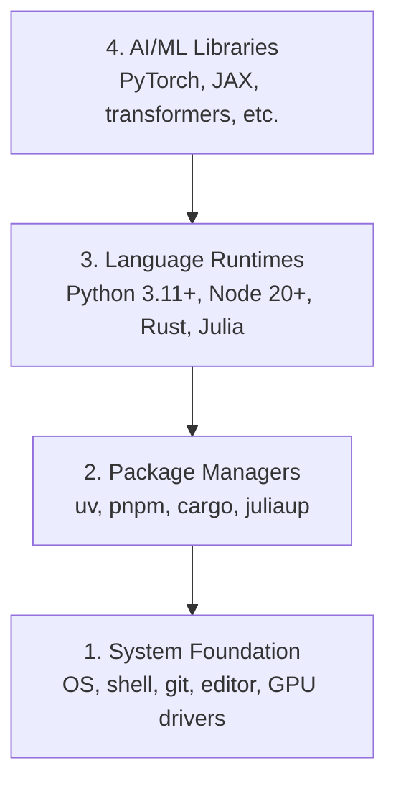

# Dev Environment
> 开发环境

> Your tools shape your thinking. Set them up once, set them up right.
> 你的工具塑造你的思维。一次配好，终身受益。

**Type:** Build
> **类型：** 构建

**Languages:** Python, Node.js, Rust
> **语言：** Python, Node.js, Rust

**Prerequisites:** None
> **前置课程：** 无

**Time:** ~45 minutes
> **时间：** ~45 分钟

## Learning Objectives
> 学习目标

- Set up Python 3.11+, Node.js 20+, and Rust toolchains from scratch
> 从零搭建 Python 3.11+、Node.js 20+ 和 Rust 工具链
- Configure virtual environments and package managers for reproducible builds
> 配置虚拟环境和包管理器，实现可复现的构建
- Verify GPU access with CUDA/MPS and run a test tensor operation
> 验证 CUDA/MPS GPU 访问并运行测试张量运算
- Understand the four-layer stack: system, packages, runtimes, AI libraries
> 理解四层技术栈：系统层、包管理层、运行时层、AI 库层

## The Problem
> 问题

You're about to learn AI engineering across 200+ lessons using Python, TypeScript, Rust, and Julia. If your environment is broken, every single lesson becomes a fight against tooling instead of learning.
> 你即将用 Python、TypeScript、Rust 和 Julia 学习 200+ 节 AI 工程课。如果你的环境有问题，每节课都会变成和工具的搏斗，而不是学习。

Most people skip environment setup. Then they spend hours debugging import errors, version conflicts, and missing CUDA drivers. We're going to do this once, properly.
> 大多数人跳过环境配置。然后花几小时调试 import 错误、版本冲突和缺失的 CUDA 驱动。我们来一次性做对。

## The Concept
> 概念

An AI engineering environment has four layers:
> AI 工程环境有四层：



> 第4层：AI/ML 库（PyTorch, JAX, transformers 等）
> 第3层：语言运行时（Python 3.11+, Node 20+, Rust, Julia）
> 第2层：包管理器（uv, pnpm, cargo, juliaup）
> 第1层：系统基础（操作系统, shell, git, 编辑器, GPU 驱动）

We install bottom-up. Each layer depends on the one below it.
> 我们自底向上安装。每一层都依赖它下面那一层。

## Build It
> 从零构建

### Step 1: System Foundation
> 步骤 1：系统基础

Check your system and install the basics.
> 检查你的系统并安装基础工具。

```bash
# macOS
xcode-select --install
brew install git curl wget

# Ubuntu/Debian
sudo apt update && sudo apt install -y build-essential git curl wget

# Windows (use WSL2)
wsl --install -d Ubuntu-24.04
```

### Step 2: Python with uv
> 步骤 2：Python 配合 uv

We use `uv` — it's 10-100x faster than pip and handles virtual environments automatically.
> 我们使用 `uv`——比 pip 快 10-100 倍，且自动管理虚拟环境。

```bash
curl -LsSf https://astral.sh/uv/install.sh | sh

uv python install 3.12

uv venv
source .venv/bin/activate  # or .venv\Scripts\activate on Windows
# Windows 上用 .venv\Scripts\activate

uv pip install numpy matplotlib jupyter
```

Verify:
> 验证：

```python
import sys
print(f"Python {sys.version}")

import numpy as np
print(f"NumPy {np.__version__}")
a = np.array([1, 2, 3])
print(f"Vector: {a}, dot product with itself: {np.dot(a, a)}")
```

### Step 3: Node.js with pnpm
> 步骤 3：Node.js 配合 pnpm

For TypeScript lessons (agents, MCP servers, web apps).
> 用于 TypeScript 课程（agent、MCP server、web 应用）。

```bash
curl -fsSL https://fnm.vercel.app/install | bash
fnm install 22
fnm use 22

npm install -g pnpm

node -e "console.log('Node', process.version)"
```

### Step 4: Rust
> 步骤 4：Rust

For performance-critical lessons (inference, systems).
> 用于性能关键课程（推理、系统）。

```bash
curl --proto '=https' --tlsv1.2 -sSf https://sh.rustup.rs | sh

rustc --version
cargo --version
```

### Step 5: Julia (Optional)
> 步骤 5：Julia（可选）

For math-heavy lessons where Julia shines.
> 用于 Julia 擅长的数学密集型课程。

```bash
curl -fsSL https://install.julialang.org | sh

julia -e 'println("Julia ", VERSION)'
```

### Step 6: GPU Setup (If You Have One)
> 步骤 6：GPU 设置（如果你有 GPU）

```bash
# NVIDIA
nvidia-smi

# Install PyTorch with CUDA
# 安装带 CUDA 的 PyTorch
uv pip install torch torchvision torchaudio --index-url https://download.pytorch.org/whl/cu124
```

```python
import torch
print(f"CUDA available: {torch.cuda.is_available()}")
if torch.cuda.is_available():
    print(f"GPU: {torch.cuda.get_device_name(0)}")
```

No GPU? No problem. Most lessons work on CPU. For training-heavy lessons, use Google Colab or cloud GPUs.
> 没 GPU？没问题。大多数课程在 CPU 上就能跑。训练密集型课程可以用 Google Colab 或云 GPU。

### Step 7: Verify Everything
> 步骤 7：验证一切

Run the verification script:
> 运行验证脚本：

```bash
python phases/00-setup-and-tooling/01-dev-environment/code/verify.py
```

## Use It
> 使用工具

Your environment is now ready for every lesson in this course. Here's what you'll use where:
> 你的环境现在已经准备好学习本课程的全部内容。以下是什么阶段用什么语言：

| Language / 语言 | Used In / 用于 | Package Manager / 包管理器 |
|----------|---------|-----------------|
| Python | Phases 1-12 (ML, DL, NLP, Vision, Audio, LLMs) | uv |
| TypeScript | Phases 13-17 (Tools, Agents, Swarms, Infra) | pnpm |
| Rust | Phases 12, 15-17 (Performance-critical systems) | cargo |
| Julia | Phase 1 (Math foundations) | Pkg |

## Ship It
> 交付制品

This lesson produces a verification script that anyone can run to check their setup.
> 本节产出一个任何人都可以运行来检查环境的验证脚本。

See `outputs/prompt-env-check.md` for a prompt that helps AI assistants diagnose environment issues.
> 参见 `outputs/prompt-env-check.md`，这是一个帮助 AI 助手诊断环境问题的 prompt。

## Exercises
> 练习

1. Run the verification script and fix any failures
> 运行验证脚本并修复所有失败项
2. Create a Python virtual environment for this course and install PyTorch
> 为本课程创建 Python 虚拟环境并安装 PyTorch
3. Write a "hello world" in all four languages and run each one
> 用四种语言各写一个 "hello world" 并运行
