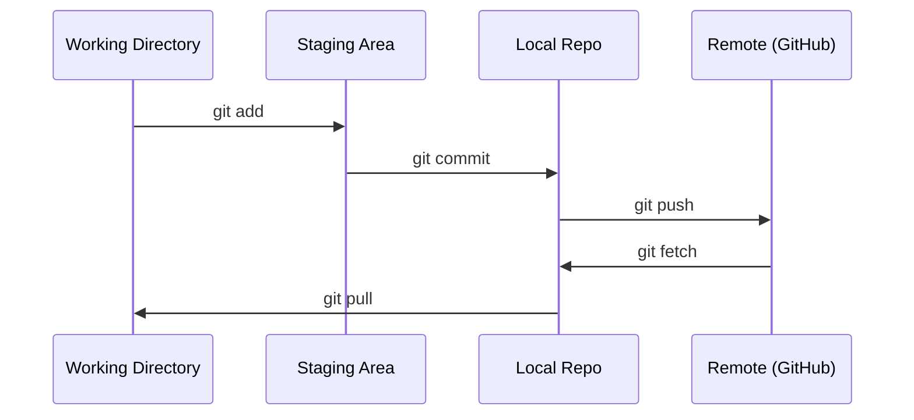

# Git & Collaboration

> Git 与协作

> Version control is not optional. Every experiment, every model, every lesson you build here gets tracked.
> 版本控制不是可选项。你在这里的每个实验、每个模型、每节课都会被追踪。

**Type:** Learn

> **类型：** 学习

**Languages:** --

> **语言：** --

**Prerequisites:** Phase 0, Lesson 01

> **前置课程：** Phase 0, Lesson 01

**Time:** ~30 minutes

> **时间：** ~30 分钟

## Learning Objectives

> 学习目标

- Configure git identity and use the daily workflow of add, commit, and push
  > 配置 git 身份信息，掌握 add、commit、push 的日常工作流
- Create and merge branches for isolated experiments without breaking main
  > 创建和合并分支，在不破坏 main 的前提下做隔离实验
- Write a `.gitignore` that excludes model checkpoints and large binary files
  > 编写 `.gitignore` 排除模型检查点和大型二进制文件
- Navigate the commit history with `git log` to understand project evolution
  > 用 `git log` 浏览提交历史，理解项目演进过程

## The Problem

> 问题

You're about to write hundreds of code files across 20 phases. Without version control you will lose work, break things you can't undo, and have no way to collaborate with others.

> 你即将在 20 个阶段中编写数百个代码文件。没有版本控制，你会丢失工作成果、搞坏无法撤销的东西，也无法与别人协作。

Git is the tool. GitHub is where the code lives. This lesson covers what you need for this course and nothing more.

> Git 是工具，GitHub 是代码的存放地。这节课只讲你在本课程中需要的内容，不搞多余。

## The Concept

> 概念




> 工作目录 → 暂存区 → 本地仓库 → 远程仓库（GitHub）

Three things to remember:

> 记住三件事：

1. Save often (`git commit`)

> 经常保存（`git commit`）
>
> 1. Push to remote (`git push`)
>
> 推送到远程（`git push`）
>
> 1. Branch for experiments (`git checkout -b experiment`)
>
> 实验用分支（`git checkout -b experiment`）

## Build It

> 从零构建

### Step 1: Configure git

> 步骤 1：配置 git

```bash
git config --global user.name "Your Name"
git config --global user.email "you@example.com"
```

### Step 2: The daily workflow

> 步骤 2：日常工作流

```bash
git status            # 看看改了什么
git add file.py       # 暂存修改
git commit -m "Add perceptron implementation"   # 提交快照
git push origin main  # 推送到 GitHub
```

### Step 3: Branching for experiments

> 步骤 3：用分支做实验

```bash
git checkout -b experiment/new-optimizer

# ... make changes, commit ...
# ... 做一些修改，提交 ...

git checkout main
git merge experiment/new-optimizer
```

### Step 4: Working with this course repo

> 步骤 4：操作本课程仓库

```bash
git clone https://github.com/rohitg00/ai-engineering-from-scratch.git
cd ai-engineering-from-scratch

git checkout -b my-progress
# work through lessons, commit your code
# 学习课程，提交你的代码
git push origin my-progress
```

## Use It

> 实际使用

For this course, you need exactly these commands:

> 本课程中，你只需要这几条命令：


| Command / 命令             | When / 什么时候用                                            |
| ------------------------ | ------------------------------------------------------- |
| `git clone`              | Get the course repo / 获取课程仓库                            |
| `git add` + `git commit` | Save your work / 保存你的工作                                 |
| `git push`               | Back it up to GitHub / 备份到 GitHub                       |
| `git checkout -b`        | Try something without breaking main / 在不破坏 main 的情况下做尝试 |
| `git log --oneline`      | See what you've done / 看看你做过什么                          |


That's it. You don't need rebase, cherry-pick, or submodules for this course.

> 就这些。本课程不需要 rebase、cherry-pick 或 submodule。

## Exercises

> 练习

1. Clone this repo, create a branch called `my-progress`, make a file, commit it, push it

> 克隆本仓库，创建 `my-progress` 分支，创建一个文件，提交并推送
>
> 1. Create a `.gitignore` that excludes model checkpoint files (`.pt`, `.pth`, `.safetensors`)
>
> 创建 `.gitignore`，排除模型检查点文件（`.pt`、`.pth`、`.safetensors`）
>
> 1. Look at the commit history of this repo with `git log --oneline` and read how lessons were added
>
> 用 `git log --oneline` 查看本仓库的提交历史，看看课程是如何逐步添加的

## Key Terms

> 关键术语

| Term | What people say | What it actually means |


| 术语     | 人们常怎么说                    | 实际含义                                                                                   |
| ------ | ------------------------- | -------------------------------------------------------------------------------------- |
| Commit | "Saving" / "保存"           | A snapshot of your entire project at a point in time / 整个项目在某个时间点的快照                   |
| Branch | "A copy" / "一份拷贝"         | A pointer to a commit that moves forward as you work / 指向某次提交的指针，随着你的工作向前移动            |
| Merge  | "Combining code" / "合并代码" | Taking changes from one branch and applying them to another / 把一个分支的改动应用到另一个分支         |
| Remote | "The cloud" / "云端"        | A copy of your repo hosted somewhere else (GitHub, GitLab) / 托管在别处（GitHub、GitLab）的仓库副本 |


