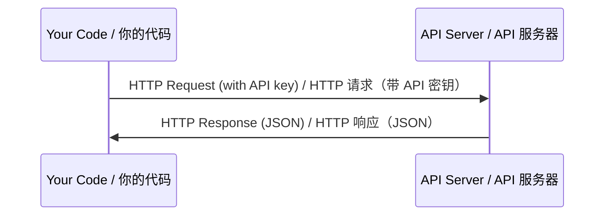

# APIs & Keys
> API 与密钥

> Every AI API works the same way: send a request, get a response. The details change, the pattern doesn't.
> 所有 AI API 的工作方式都一样：发请求，收响应。细节会变，模式不变。

**Type:** Build
> **类型：** 构建

**Languages:** Python, TypeScript
> **语言：** Python, TypeScript

**Prerequisites:** Phase 0, Lesson 01
> **前置课程：** Phase 0, Lesson 01

**Time:** ~30 minutes
> **时间：** ~30 分钟

## Learning Objectives
> 学习目标

- Store API keys securely using environment variables and `.env` files
> 使用环境变量和 `.env` 文件安全地存储 API 密钥
- Make an LLM API call using both the Anthropic Python SDK and raw HTTP
> 使用 Anthropic Python SDK 和原始 HTTP 两种方式调用 LLM API
- Compare SDK-based and raw HTTP request/response formats for debugging
> 对比 SDK 和原始 HTTP 的请求/响应格式，用于调试
- Identify and handle common API errors including authentication and rate limits
> 识别和处理常见 API 错误，包括认证失败和速率限制

## The Problem
> 问题

Starting from Phase 11, you'll call LLM APIs (Anthropic, OpenAI, Google). In Phase 13-16 you'll build agents that use these APIs in loops. You need to know how API keys work, how to store them safely, and how to make your first API call.
> 从 Phase 11 开始，你会调用 LLM API（Anthropic、OpenAI、Google）。在 Phase 13-16 中你将构建循环调用这些 API 的 Agent。你需要知道 API 密钥的工作原理、如何安全存储、以及如何发出你的第一次 API 调用。

## The Concept
> 概念



Every API call has:
> 每次 API 调用包含：
1. An endpoint (URL)
> 一个端点（URL）
2. An API key (authentication)
> 一个 API 密钥（身份认证）
3. A request body (what you want)
> 一个请求体（你想要什么）
4. A response body (what you get back)
> 一个响应体（你得到了什么）

## Build It
> 从零构建

### Step 1: Store API keys safely
> 步骤 1：安全存储 API 密钥

Never put API keys in code. Use environment variables.
> 绝对不要把 API 密钥写在代码里。用环境变量。

```bash
export ANTHROPIC_API_KEY="sk-ant-..."
export OPENAI_API_KEY="sk-..."
```

Or use a `.env` file (add it to `.gitignore`):
> 或者用 `.env` 文件（记得加入 `.gitignore`）：

```
ANTHROPIC_API_KEY=sk-ant-...
OPENAI_API_KEY=sk-...
```

### Step 2: First API call (Python)
> 步骤 2：第一次 API 调用（Python）

```python
import anthropic

client = anthropic.Anthropic()

response = client.messages.create(
    model="claude-sonnet-4-20250514",
    max_tokens=256,
    messages=[{"role": "user", "content": "What is a neural network in one sentence?"}]
)

print(response.content[0].text)
```

### Step 3: First API call (TypeScript)
> 步骤 3：第一次 API 调用（TypeScript）

```typescript
import Anthropic from "@anthropic-ai/sdk";

const client = new Anthropic();

const response = await client.messages.create({
  model: "claude-sonnet-4-20250514",
  max_tokens: 256,
  messages: [{ role: "user", content: "What is a neural network in one sentence?" }],
});

console.log(response.content[0].text);
```

### Step 4: Raw HTTP (no SDK)
> 步骤 4：原始 HTTP（不用 SDK）

```python
import os
import urllib.request
import json

url = "https://api.anthropic.com/v1/messages"
headers = {
    "Content-Type": "application/json",
    "x-api-key": os.environ["ANTHROPIC_API_KEY"],
    "anthropic-version": "2023-06-01",
}
body = json.dumps({
    "model": "claude-sonnet-4-20250514",
    "max_tokens": 256,
    "messages": [{"role": "user", "content": "What is a neural network in one sentence?"}],
}).encode()

req = urllib.request.Request(url, data=body, headers=headers, method="POST")
with urllib.request.urlopen(req) as resp:
    result = json.loads(resp.read())
    print(result["content"][0]["text"])
```

This is what the SDKs do under the hood. Understanding the raw HTTP call helps when debugging.
> 这就是 SDK 底层做的事情。理解原始 HTTP 调用有助于调试。

## Use It
> 使用场景

For this course:
> 本课程中：

| API | When you need it | Free tier |
> | API | 什么时候需要 | 免费额度 |
|-----|-----------------|-----------|
| Anthropic (Claude) | Phases 11-16 (agents, tools) | $5 credit on signup |
> | Anthropic (Claude) | Phase 11-16（agent、工具） | 注册送 $5 |
| OpenAI | Phase 11 (comparison) | $5 credit on signup |
> | OpenAI | Phase 11（对比） | 注册送 $5 |
| Hugging Face | Phases 4-10 (models, datasets) | Free |
> | Hugging Face | Phase 4-10（模型、数据集） | 免费 |

You don't need all of them right now. Set them up when the lesson requires it.
> 你现在不需要全部注册。用到的时候再配。

## Ship It
> 交付制品

This lesson produces:
> 本节产出：
- `outputs/prompt-api-troubleshooter.md` - diagnose common API errors
> `outputs/prompt-api-troubleshooter.md` - 诊断常见 API 错误

## Exercises
> 练习

1. Get an Anthropic API key and make your first API call
> 获取 Anthropic API 密钥，完成你的第一次 API 调用
2. Try the raw HTTP version and compare the response format to the SDK version
> 试试原始 HTTP 版本，对比和 SDK 版本的响应格式有什么区别
3. Intentionally use a wrong API key and read the error message
> 故意用错误的 API 密钥，看看返回什么错误信息

## Key Terms
> 关键术语

| Term | What people say | What it actually means |
> | 术语 | 人们常怎么说 | 实际含义 |
|------|----------------|----------------------|
| API key | "Password for the API" | A unique string that identifies your account and authorizes requests |
> | API 密钥 | "API 的密码" | 标识你账户的唯一字符串，用于授权请求 |
| Rate limit | "They're throttling me" | Maximum requests per minute/hour to prevent abuse and ensure fair usage |
> | 速率限制 | "我被限流了" | 每分钟/每小时最大请求数，防止滥用，保证公平使用 |
| Token | "A word" (in API context) | A billing unit: input and output tokens are counted and charged separately |
> | Token | "一个词"（API 语境下） | 计费单位：输入和输出 token 分别计数和收费 |
| Streaming | "Real-time responses" | Getting the response word by word instead of waiting for the full response |
> | 流式传输 | "实时响应" | 逐字获取响应，而不是等完整响应生成完才看到 |
