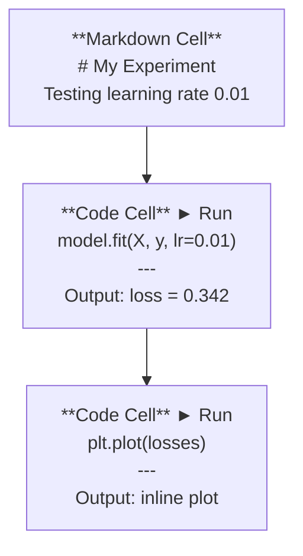
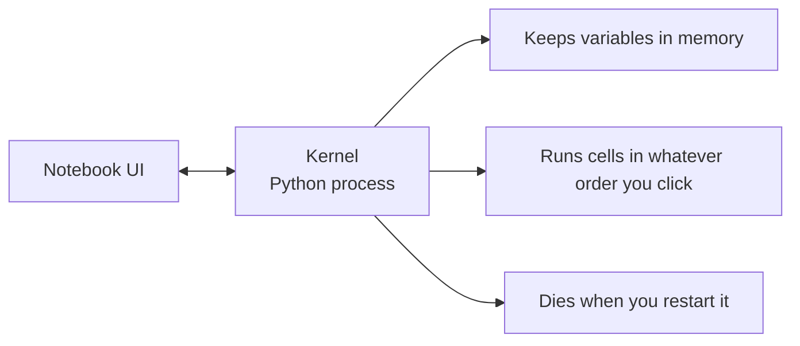

# Jupyter Notebooks
> Jupyter Notebook 使用指南

> Notebooks are the lab bench of AI engineering. You prototype here, then move what works into production.
> Notebook 是 AI 工程的实验台。你在这里做原型，验证通过后再搬到生产环境。

**Type:** Build
> **类型：** 构建

**Languages:** Python
> **语言：** Python

**Prerequisites:** Phase 0, Lesson 01
> **前置课程：** Phase 0, Lesson 01

**Time:** ~30 minutes
> **时间：** ~30 分钟

## Learning Objectives
> 学习目标

- Install and launch JupyterLab, Jupyter Notebook, or VS Code with the Jupyter extension
> 安装并启动 JupyterLab、Jupyter Notebook 或带 Jupyter 扩展的 VS Code
- Use magic commands (`%timeit`, `%%time`, `%matplotlib inline`) to benchmark and visualize inline
> 使用魔术命令（`%timeit`、`%%time`、`%matplotlib inline`）进行基准测试和内联可视化
- Distinguish when to use notebooks vs scripts and apply the "explore in notebooks, ship in scripts" workflow
> 区分什么时候用 notebook、什么时候用脚本，遵循「notebook 做探索，脚本做交付」的工作流
- Identify and avoid common notebook traps: out-of-order execution, hidden state, and memory leaks
> 识别并避开常见的 notebook 陷阱：乱序执行、隐藏状态和内存泄漏

## The Problem
> 问题

Every AI paper, tutorial, and Kaggle competition uses Jupyter notebooks. They let you run code in pieces, see outputs inline, mix code with explanations, and iterate fast. If you try to learn AI without notebooks, you're doing math homework without scratch paper.
> 每篇 AI 论文、每个教程、每场 Kaggle 比赛都用 Jupyter notebook。它们让你分段运行代码、内联查看输出、将代码和解释混合在一起、快速迭代。如果学 AI 不用 notebook，就像做数学作业不用草稿纸。

But notebooks have real traps. People use them for everything, including things they're terrible at. Knowing when to use a notebook and when to use a script will save you from debugging nightmares later.
> 但 notebook 也有真正的陷阱。人们什么都用 notebook，包括它根本不擅长的事情。知道什么时候用 notebook、什么时候用脚本，能让你免于日后的调试噩梦。

## The Concept
> 概念

A notebook is a list of cells. Each cell is either code or text.
> Notebook 是一串单元格组成的列表。每个单元格要么是代码，要么是文本。


> Markdown 单元格 → 代码单元格（含输出）→ 代码单元格（含图表）

The kernel is a Python process running in the background. When you run a cell, it sends the code to the kernel, which executes it and sends back the result. All cells share the same kernel, so variables persist between cells.
> Kernel（内核）是一个在后台运行的 Python 进程。你运行一个单元格时，代码被发送到 kernel 执行，结果返回显示。所有单元格共享同一个 kernel，所以变量在单元格之间持久存在。


> Notebook 界面 ↔ Kernel（Python 进程）→ 持有变量 / 按点击顺序执行 / 重启即清空

That "whatever order you click" part is both the superpower and the foot-gun.
> 「按你点击的顺序执行」这件事，既是超能力，也是绊脚石。

## Build It
> 从零构建

### Step 1: Pick your interface
> 步骤 1：选择你的界面

Three options, one format:
> 三种选择，同一种格式：

| Interface | Install | Best for |
> | 界面 | 安装方式 | 最适合 |
|-----------|---------|----------|
| JupyterLab | `pip install jupyterlab` then `jupyter lab` | Full IDE experience, multiple tabs, file browser, terminal |
> | JupyterLab | `pip install jupyterlab` 然后 `jupyter lab` | 完整 IDE 体验，多标签页，文件浏览器，终端 |
| Jupyter Notebook | `pip install notebook` then `jupyter notebook` | Simple, lightweight, one notebook at a time |
> | Jupyter Notebook | `pip install notebook` 然后 `jupyter notebook` | 简单、轻量，一次一个 notebook |
| VS Code | Install "Jupyter" extension | Already in your editor, git integration, debugging |
> | VS Code | 安装 "Jupyter" 扩展 | 在编辑器里直接用，有 git 集成和调试功能 |

All three read and write the same `.ipynb` file. Pick whatever you like. JupyterLab is the most common in AI work.
> 三者读写同样的 `.ipynb` 文件。选你喜欢的就行。JupyterLab 在 AI 工作中最常见。

```bash
pip install jupyterlab
jupyter lab
```

### Step 2: Keyboard shortcuts that matter
> 步骤 2：重要的快捷键

You operate in two modes. Press `Escape` for command mode (blue bar on the left), `Enter` for edit mode (green bar).
> 有两种模式。按 `Escape` 进入命令模式（左边蓝色条），按 `Enter` 进入编辑模式（绿色条）。

**Command mode (most used):**
> **命令模式（最常用）：**

| Key | Action |
> | 按键 | 操作 |
|-----|--------|
| `Shift+Enter` | Run cell, move to next |
> | `Shift+Enter` | 运行当前单元格，移到下一个 |
| `A` | Insert cell above |
> | `A` | 在上方插入单元格 |
| `B` | Insert cell below |
> | `B` | 在下方插入单元格 |
| `DD` | Delete cell |
> | `DD` | 删除单元格 |
| `M` | Convert to markdown |
> | `M` | 转为 Markdown 单元格 |
| `Y` | Convert to code |
> | `Y` | 转为代码单元格 |
| `Z` | Undo cell operation |
> | `Z` | 撤销单元格操作 |
| `Ctrl+Shift+H` | Show all shortcuts |
> | `Ctrl+Shift+H` | 显示所有快捷键 |

**Edit mode:**
> **编辑模式：**

| Key | Action |
> | 按键 | 操作 |
|-----|--------|
| `Tab` | Autocomplete |
> | `Tab` | 自动补全 |
| `Shift+Tab` | Show function signature |
> | `Shift+Tab` | 显示函数签名 |
| `Ctrl+/` | Toggle comment |
> | `Ctrl+/` | 切换注释 |

`Shift+Enter` is the one you'll use a thousand times a day. Learn it first.
> `Shift+Enter` 是你每天会按上千次的键。先学会它。

### Step 3: Cell types
> 步骤 3：单元格类型

**Code cells** run Python and show the output:
> **代码单元格** 运行 Python 并显示输出：

```python
import numpy as np
data = np.random.randn(1000)
data.mean(), data.std()
```

Output: `(0.0032, 0.9987)`
> 输出：`(0.0032, 0.9987)`

**Markdown cells** render formatted text. Use them to document what you're doing and why. Supports headers, bold, italic, LaTeX math (`$E = mc^2$`), tables, and images.
> **Markdown 单元格** 渲染格式化文本。用来记录你在做什么和为什么。支持标题、粗体、斜体、LaTeX 数学公式（`$E = mc^2$`）、表格和图片。

### Step 4: Magic commands
> 步骤 4：魔术命令

These aren't Python. They're Jupyter-specific commands that start with `%` (line magic) or `%%` (cell magic).
> 这些不是 Python。它们是 Jupyter 特有的命令，以 `%`（行魔术）或 `%%`（单元格魔术）开头。

**Time your code:**
> **为代码计时：**

```python
%timeit np.random.randn(10000)
```

Output: `45.2 us +/- 1.3 us per loop`
> 输出：`45.2 us +/- 1.3 us per loop`

```python
%%time
model.fit(X_train, y_train, epochs=10)
```

Output: `Wall time: 2.34 s`
> 输出：`Wall time: 2.34 s`

`%timeit` runs the code many times and averages. `%%time` runs it once. Use `%timeit` for microbenchmarks, `%%time` for training runs.
> `%timeit` 多次运行取平均。`%%time` 只跑一次。用 `%timeit` 做微基准测试，用 `%%time` 量训练时间。

**Enable inline plots:**
> **启用内联图表：**

```python
%matplotlib inline
```

Every `plt.plot()` or `plt.show()` now renders directly in the notebook.
> 此后所有 `plt.plot()` 或 `plt.show()` 都直接渲染在 notebook 里。

**Install packages without leaving the notebook:**
> **在 notebook 里安装包：**

```python
!pip install scikit-learn
```

The `!` prefix runs any shell command.
> `!` 前缀可以运行任意 shell 命令。

**Check environment variables:**
> **查看环境变量：**

```python
%env CUDA_VISIBLE_DEVICES
```

### Step 5: Display rich output inline
> 步骤 5：内联显示富文本输出

Notebooks auto-display the last expression in a cell. But you can control it:
> Notebook 会自动显示单元格中最后一个表达式的值：

```python
import pandas as pd

df = pd.DataFrame({
    "model": ["Linear", "Random Forest", "Neural Net"],
    "accuracy": [0.72, 0.89, 0.94],
    "training_time": [0.1, 2.3, 45.6]
})
df
```

This renders a formatted HTML table, not a text dump. Same with plots:
> 这会渲染一个格式化的 HTML 表格，而不是纯文本。图表也一样：

```python
import matplotlib.pyplot as plt

plt.figure(figsize=(8, 4))
plt.plot([1, 2, 3, 4], [1, 4, 2, 3])
plt.title("Inline Plot")
plt.show()
```

The plot appears right below the cell. This is why notebooks dominate AI work. You see the data, the plot, and the code together.
> 图表直接出现在单元格下方。这就是为什么 notebook 主导了 AI 领域——你能同时看到数据、图表和代码。

For images:
> 显示图片：

```python
from IPython.display import Image, display
display(Image(filename="architecture.png"))
```

### Step 6: Google Colab
> 步骤 6：Google Colab

Colab is a free Jupyter notebook in the cloud. It gives you a GPU, pre-installed libraries, and Google Drive integration. No setup required.
> Colab 是免费的云端 Jupyter notebook。提供 GPU、预装库和 Google Drive 集成。无需任何配置。

1. Go to [colab.research.google.com](https://colab.research.google.com)
> 打开 [colab.research.google.com](https://colab.research.google.com)
2. Upload any `.ipynb` file from this course
> 上传本课程中的任意 `.ipynb` 文件
3. Runtime > Change runtime type > T4 GPU (free)
> 运行时 > 更改运行时类型 > T4 GPU（免费）

Colab differences from local Jupyter:
> Colab 和本地 Jupyter 的区别：
- Files don't persist between sessions (save to Drive or download)
> 文件不会在会话间保留（保存到 Drive 或下载到本地）
- Pre-installed: numpy, pandas, matplotlib, torch, tensorflow, sklearn
> 预装：numpy, pandas, matplotlib, torch, tensorflow, sklearn
- `from google.colab import files` to upload/download files
> `from google.colab import files` 上传/下载文件
- `from google.colab import drive; drive.mount('/content/drive')` for persistent storage
> `from google.colab import drive; drive.mount('/content/drive')` 挂载持久存储
- Sessions time out after 90 minutes of inactivity (free tier)
> 免费版 90 分钟无操作自动断开

## Use It
> 使用场景

### Notebooks vs Scripts: When to use which
> Notebook vs 脚本：什么时候用哪个

| Use notebooks for | Use scripts for |
> | 用 notebook 做 | 用脚本做 |
|-------------------|-----------------|
| Exploring a dataset | Training pipelines |
> | 探索数据集 | 训练流水线 |
| Prototyping a model | Reusable utilities |
> | 原型验证模型 | 可复用工具 |
| Visualizing results | Anything with `if __name__` |
> | 可视化结果 | 任何带 `if __name__` 的 |
| Explaining your work | Code that runs on a schedule |
> | 解释你的工作 | 定时运行的代码 |
| Quick experiments | Production code |
> | 快速实验 | 生产环境代码 |
| Course exercises | Packages and libraries |
> | 课程练习 | 包和库 |

The rule: **explore in notebooks, ship in scripts**.
> 原则：**notebook 做探索，脚本做交付**。

A common workflow in AI:
> AI 领域的常见工作流：
1. Explore data in a notebook
> 在 notebook 里探索数据
2. Prototype your model in the notebook
> 在 notebook 里做模型原型
3. Once it works, move the code to `.py` files
> 跑通之后，把代码搬到 `.py` 文件
4. Import those `.py` files back into the notebook for further experiments
> 把 `.py` 文件 import 回 notebook，继续实验

### Common traps
> 常见陷阱

**Out-of-order execution.** You run cell 5, then cell 2, then cell 7. The notebook works on your machine but breaks when someone runs it top to bottom. Fix: Kernel > Restart & Run All before sharing.
> **乱序执行。** 你先运行了单元格 5，再运行单元格 2，然后是单元格 7。在你机器上能跑，但别人从头到尾顺序执行时就崩了。解决：分享前 Kernel > Restart & Run All。

**Hidden state.** You delete a cell but the variable it created is still in memory. The notebook looks clean but depends on a ghost cell. Fix: Restart the kernel regularly.
> **隐藏状态。** 你删掉了一个单元格，但它创建的变量还在内存里。notebook 看起来干净，实际上依赖着幽灵单元格。解决：定期重启 kernel。

**Memory leaks.** Loading a 4GB dataset, training a model, loading another dataset. Nothing gets freed. Fix: `del variable_name` and `gc.collect()`, or restart the kernel.
> **内存泄漏。** 加载 4GB 数据集、训练模型、再加载另一个数据集。什么都没释放。解决：`del 变量名` 和 `gc.collect()`，或者重启 kernel。

## Ship It
> 交付制品

This lesson produces:
> 本节产出：
- `outputs/prompt-notebook-helper.md` for debugging notebook issues
> `outputs/prompt-notebook-helper.md` - 用于调试 notebook 问题

## Exercises
> 练习

1. Open JupyterLab, create a notebook, and use `%timeit` to compare list comprehension vs numpy for creating an array of 100,000 random numbers
> 打开 JupyterLab，创建 notebook，用 `%timeit` 比较列表推导式 vs numpy 创建 100,000 个随机数的性能
2. Create a notebook with both markdown and code cells that loads a CSV, displays a dataframe, and plots a chart. Then run Kernel > Restart & Run All to verify it works top to bottom
> 创建一个包含 markdown 和代码单元格的 notebook，加载 CSV、显示 dataframe、绘制图表。然后 Kernel > Restart & Run All 验证它能从头到尾顺序执行
3. Take the code from `code/notebook_tips.py`, paste it into a Colab notebook, and run it with a free GPU
> 把 `code/notebook_tips.py` 的代码粘贴到 Colab notebook，用免费 GPU 运行

## Key Terms
> 关键术语

| Term | What people say | What it actually means |
> | 术语 | 人们常怎么说 | 实际含义 |
|------|----------------|----------------------|
| Kernel | "The thing running my code" | A separate Python process that executes cells and keeps variables in memory |
> | Kernel | "跑我代码的那个东西" | 一个独立的 Python 进程，执行单元格代码并将变量保存在内存中 |
| Cell | "A code block" | An independently runnable unit in a notebook, either code or markdown |
> | 单元格 | "一个代码块" | notebook 中可独立运行的最小单元，可以是代码或 markdown |
| Magic command | "Jupyter tricks" | Special commands prefixed with `%` or `%%` that control the notebook environment |
> | 魔术命令 | "Jupyter 技巧" | 以 `%` 或 `%%` 开头的特殊命令，用于控制 notebook 环境 |
| `.ipynb` | "Notebook file" | A JSON file containing cells, outputs, and metadata. Stands for IPython Notebook |
> | `.ipynb` | "Notebook 文件" | 包含单元格、输出和元数据的 JSON 文件。全称 IPython Notebook |

## Further Reading
> 延伸阅读

- [JupyterLab Docs](https://jupyterlab.readthedocs.io/) for the full feature set
> [JupyterLab 文档](https://jupyterlab.readthedocs.io/) — 完整功能列表
- [Google Colab FAQ](https://research.google.com/colaboratory/faq.html) for Colab-specific limits and features
> [Google Colab FAQ](https://research.google.com/colaboratory/faq.html) — Colab 的限制和特性
- [28 Jupyter Notebook Tips](https://www.dataquest.io/blog/jupyter-notebook-tips-tricks-shortcuts/) for power-user shortcuts
> [28 个 Jupyter Notebook 技巧](https://www.dataquest.io/blog/jupyter-notebook-tips-tricks-shortcuts/) — 进阶快捷键
