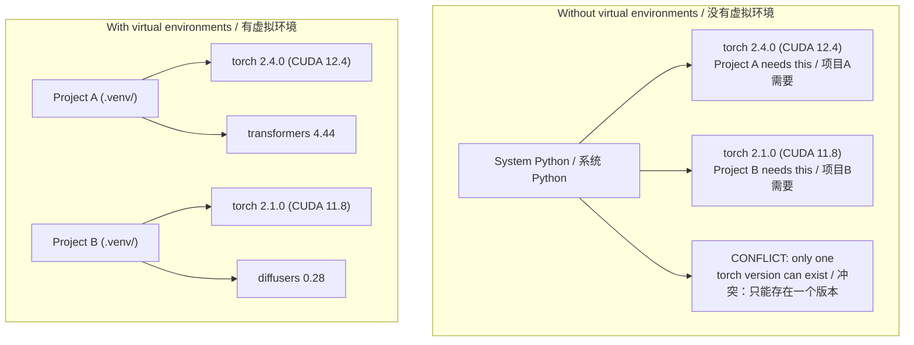

# Python Environments
> Python 虚拟环境

> Dependency hell is real. Virtual environments are the cure.
> 依赖地狱是真实存在的。虚拟环境就是解药。

**Type:** Build
> **类型：** 构建

**Languages:** Shell
> **语言：** Shell

**Prerequisites:** Phase 0, Lesson 01
> **前置课程：** Phase 0, Lesson 01

**Time:** ~30 minutes
> **时间：** ~30 分钟

## Learning Objectives
> 学习目标

- Create isolated virtual environments using `uv`, `venv`, or `conda`
> 使用 `uv`、`venv` 或 `conda` 创建隔离的虚拟环境
- Write a `pyproject.toml` with optional dependency groups and generate lockfiles for reproducibility
> 编写带可选依赖组的 `pyproject.toml`，生成 lockfile 确保可复现
- Diagnose and fix common pitfalls: global installs, pip/conda mixing, CUDA version mismatches
> 诊断和修复常见陷阱：全局安装、pip/conda 混用、CUDA 版本不匹配
- Implement a per-phase environment strategy for projects with conflicting dependencies
> 为有冲突依赖的项目实现按阶段划分的环境策略

## The Problem
> 问题

You install PyTorch 2.4 for a fine-tuning project. Next week, a different project needs PyTorch 2.1 because its CUDA build is pinned. You upgrade globally, and the first project breaks. You downgrade, and the second one breaks.
> 你给微调项目装了 PyTorch 2.4。下周，另一个项目需要 PyTorch 2.1，因为它的 CUDA 版本被锁定了。你全局升级，第一个项目崩了。你降级回去，第二个项目又崩了。

This is dependency hell. It happens constantly in AI/ML work because:
> 这就是依赖地狱。在 AI/ML 工作中，这事经常发生，因为：

- PyTorch, JAX, and TensorFlow each ship their own CUDA bindings
> PyTorch、JAX、TensorFlow 各自带有自己的 CUDA 绑定
- Model libraries pin specific framework versions
> 模型库会锁定特定框架版本
- A global `pip install` overwrites whatever was there before
> 全局 `pip install` 会覆盖之前装过的任何东西
- CUDA 11.8 builds don't work with CUDA 12.x drivers (and vice versa)
> CUDA 11.8 编译的包不兼容 CUDA 12.x 驱动（反之亦然）

The fix: every project gets its own isolated environment with its own packages.
> 解决方案：每个项目拥有自己独立的隔离环境，各自管理各自的包。

## The Concept
> 概念



## Build It
> 从零构建

### Option 1: uv venv (Recommended)
> 方案 1：uv venv（推荐）

`uv` is the fastest Python package manager (10-100x faster than pip). It handles virtual environments, Python versions, and dependency resolution in one tool.
> `uv` 是最快的 Python 包管理器（比 pip 快 10-100 倍）。一个工具搞定虚拟环境、Python 版本和依赖解析。

```bash
curl -LsSf https://astral.sh/uv/install.sh | sh

uv python install 3.12

cd your-project
uv venv
source .venv/bin/activate  # Linux/macOS
# Windows: .venv\Scripts\activate
```

Install packages:
> 安装包：

```bash
uv pip install torch numpy
```

Create a project with `pyproject.toml` in one step:
> 一步创建带 `pyproject.toml` 的项目：

```bash
uv init my-ai-project
cd my-ai-project
uv add torch numpy matplotlib
```

### Option 2: venv (Built-in)
> 方案 2：venv（内置）

If you can't install `uv`, Python ships with `venv`:
> 如果装不了 `uv`，Python 自带 `venv`：

```bash
python3 -m venv .venv
source .venv/bin/activate  # Linux/macOS
.venv\Scripts\activate     # Windows

pip install torch numpy
```

Slower than `uv`, but works everywhere Python is installed.
> 比 `uv` 慢，但只要有 Python 就能用。

### Option 3: conda (When You Need It)
> 方案 3：conda（需要时再用）

Conda manages non-Python dependencies like CUDA toolkits, cuDNN, and C libraries. Use it when:
> Conda 管理非 Python 依赖，比如 CUDA 工具包、cuDNN 和 C 库。什么时候用：

- You need a specific CUDA toolkit version without installing it system-wide
> 需要特定 CUDA 工具包版本，但不想全局安装
- You're on a shared cluster where you can't install system packages
> 在共享集群上，无法装系统级包
- A library's install instructions say "use conda"
> 某个库的安装教程明确说「用 conda」

```bash
# Install miniconda (not the full Anaconda)
# 安装 miniconda（不要装完整的 Anaconda）
curl -LsSf https://repo.anaconda.com/miniconda/Miniconda3-latest-Linux-x86_64.sh -o miniconda.sh
bash miniconda.sh -b

conda create -n myproject python=3.12
conda activate myproject

conda install pytorch torchvision torchaudio pytorch-cuda=12.4 -c pytorch -c nvidia
```

One rule: if you use conda for an environment, use conda for all packages in that environment. Mixing `pip install` into a conda env causes dependency conflicts that are painful to debug.
> 一条铁律：如果你用 conda 管理环境，就全用 conda。在 conda 环境里混用 `pip install` 会导致极难调试的依赖冲突。

### For This Course: Per-Phase Strategy
> 本课程：按阶段划分环境

You could create one environment for the whole course. Don't. Different phases need different (sometimes conflicting) dependencies.
> 你可以整个课程用一个大而全的环境。别这么做。不同阶段需要不同的（有时相互冲突的）依赖。

Strategy:
> 策略：

```
ai-engineering-from-scratch/
├── .venv/                    <-- shared lightweight env for phases 0-3
│                                  Phase 0-3 共用轻量环境
├── phases/
│   ├── 04-neural-networks/
│   │   └── .venv/            <-- PyTorch env / PyTorch 环境
│   ├── 05-cnns/
│   │   └── .venv/            <-- same PyTorch env (symlink or shared)
│   │                             同上（软链接或共用）
│   ├── 08-transformers/
│   │   └── .venv/            <-- might need different transformer versions
│   │                             可能需要不同版本的 transformer
│   └── 11-llm-apis/
│       └── .venv/            <-- API SDKs, no torch needed
│                                 API SDK，不需要 PyTorch
```

The script in `code/env_setup.sh` creates the base environment for this course.
> `code/env_setup.sh` 脚本为本课程创建基础环境。

## pyproject.toml Basics
> pyproject.toml 基础

Every Python project should have a `pyproject.toml`. It replaces `setup.py`, `setup.cfg`, and `requirements.txt` in one file.
> 每个 Python 项目都应该有一个 `pyproject.toml`。一个文件取代 `setup.py`、`setup.cfg` 和 `requirements.txt`。

```toml
[project]
name = "ai-engineering-from-scratch"
version = "0.1.0"
requires-python = ">=3.11"
dependencies = [
    "numpy>=1.26",
    "matplotlib>=3.8",
    "jupyter>=1.0",
    "scikit-learn>=1.4",
]

[project.optional-dependencies]
torch = ["torch>=2.3", "torchvision>=0.18"]
llm = ["anthropic>=0.39", "openai>=1.50"]
```

Then install:
> 然后安装：

```bash
uv pip install -e ".[torch]"      # base + PyTorch / 基础 + PyTorch
uv pip install -e ".[llm]"        # base + LLM SDKs / 基础 + LLM SDK
uv pip install -e ".[torch,llm]"  # everything / 全装
```

## Lockfiles
> 锁定文件

A lockfile pins every dependency (including transitive ones) to exact versions. This guarantees reproducibility: anyone who installs from the lockfile gets exactly the same packages.
> Lockfile 把每个依赖（包括传递依赖）锁定到精确版本。保证可复现：任何人从 lockfile 安装都能得到完全一致的包。

```bash
# uv generates uv.lock automatically when using uv add
# 用 uv add 时 uv 自动生成 uv.lock
uv add numpy

# pip-tools approach / pip-tools 方案
uv pip compile pyproject.toml -o requirements.lock
uv pip install -r requirements.lock
```

Commit your lockfile to git. When someone clones the repo, they install from the lockfile and get identical versions.
> 把 lockfile 提交到 git。别人 clone 仓库时从 lockfile 安装，得到完全一样的版本。

## Common Mistakes
> 常见错误

### 1. Installing globally
> 1. 装到了全局环境

```bash
pip install torch  # BAD: installs to system Python / 错误：装到系统 Python

source .venv/bin/activate  # 或 .venv\Scripts\activate
pip install torch  # GOOD: installs to virtual environment / 正确：装到虚拟环境
```

Check where your packages go:
> 检查你的包装到了哪里：

```bash
which python       # should show .venv/bin/python, not /usr/bin/python
# Windows: where python
which pip           # should show .venv/bin/pip
```

### 2. Mixing pip and conda
> 2. pip 和 conda 混用

```bash
conda create -n myenv python=3.12
conda activate myenv
conda install pytorch -c pytorch
pip install some-other-package   # BAD: can break conda's dependency tracking
                                 # 错误：会破坏 conda 的依赖追踪
conda install some-other-package # GOOD: let conda manage everything
                                 # 正确：让 conda 管理一切
```

If you must use pip inside conda (some packages are pip-only), install all conda packages first, then pip packages last.
> 如果非要在 conda 里用 pip（有些包只有 pip 有），先装完所有 conda 包，最后再用 pip。

### 3. Forgetting to activate
> 3. 忘了激活

```bash
python train.py           # uses system Python, missing packages
                          # 用了系统 Python，找不到包
source .venv/bin/activate # 或 .venv\Scripts\activate
python train.py           # uses project Python, packages found
                          # 用了项目 Python，包都在
```

Your shell prompt should show the environment name:
> 终端提示符应显示环境名：

```
(.venv) $ python train.py
```

### 4. Committing .venv to git
> 4. 把 .venv 提交到 git

```bash
echo ".venv/" >> .gitignore
```

Virtual environments are 200MB-2GB. They're local, not portable between machines. Commit `pyproject.toml` and the lockfile instead.
> 虚拟环境 200MB-2GB。它是本地的，不能跨机器移植。提交 `pyproject.toml` 和 lockfile 就好。

### 5. CUDA version mismatch
> 5. CUDA 版本不匹配

```bash
nvidia-smi                # shows driver CUDA version (e.g., 12.4)
                          # 显示驱动 CUDA 版本
python -c "import torch; print(torch.version.cuda)"  # shows PyTorch CUDA version
                                                     # 显示 PyTorch CUDA 版本
# These must be compatible.
# 这两个必须兼容。
# PyTorch CUDA version must be <= driver CUDA version.
# PyTorch 的 CUDA 版本必须 <= 驱动的 CUDA 版本。
```

## Use It
> 实际使用

Run the setup script to create your course environment:
> 运行配置脚本创建课程环境：

```bash
bash phases/00-setup-and-tooling/06-python-environments/code/env_setup.sh
```

This creates a `.venv` at the repo root with core dependencies installed and verified.
> 在仓库根目录创建 `.venv`，安装并验证核心依赖。

## Exercises
> 练习

1. Run `env_setup.sh` and verify all checks pass
> 运行 `env_setup.sh`，确认所有检查通过
2. Create a second virtual environment, install a different version of numpy in it, and confirm the two environments are isolated
> 创建第二个虚拟环境，在里面装不同版本的 numpy，验证两个环境相互隔离
3. Write a `pyproject.toml` for a project that needs both PyTorch and the Anthropic SDK
> 为一个同时需要 PyTorch 和 Anthropic SDK 的项目写 `pyproject.toml`
4. Deliberately install a package globally (without activating a venv), notice where it goes, then uninstall it
> 故意在全局装一个包（不激活 venv），看它装到了哪里，然后卸载

## Key Terms
> 关键术语

| Term | What people say | What it actually means |
> | 术语 | 人们常怎么说 | 实际含义 |
|------|----------------|----------------------|
| Virtual environment | "A venv" | An isolated directory containing a Python interpreter and packages, separate from the system Python |
> | 虚拟环境 | "一个 venv" | 包含 Python 解释器和包集合的隔离目录，和系统 Python 互不影响 |
| Lockfile | "Pinned dependencies" | A file listing every package and its exact version, guaranteeing identical installs across machines |
> | Lockfile | "锁定版本" | 列出每个包及其精确版本的文件，保证跨机器安装一致性 |
| pyproject.toml | "The new setup.py" | The standard Python project configuration file, replacing setup.py/setup.cfg/requirements.txt |
> | pyproject.toml | "新一代 setup.py" | Python 项目标准配置文件，替代 setup.py/setup.cfg/requirements.txt |
| Transitive dependency | "A dependency of a dependency" | Package B depends on C; if you install A which depends on B, C is a transitive dependency of A |
> | 传递依赖 | "依赖的依赖" | 包 B 依赖 C；你装 A（依赖 B），C 就是 A 的传递依赖 |
| CUDA mismatch | "My GPU isn't working" | PyTorch was compiled for a different CUDA version than what your GPU driver supports |
> | CUDA 不匹配 | "我 GPU 用不了" | PyTorch 编译时的 CUDA 版本和你 GPU 驱动支持的 CUDA 版本不匹配 |
