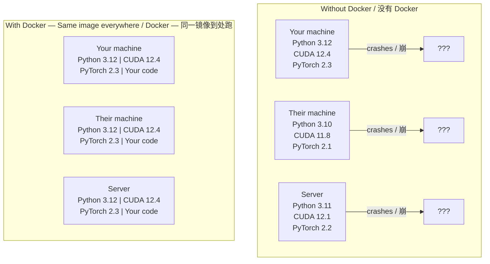

# Docker for AI
> AI 开发中的 Docker

> Containers make "works on my machine" a thing of the past.
> 容器让「在我机器上能跑」变成历史。

**Type:** Build
> **类型：** 构建

**Languages:** Docker
> **语言：** Docker

**Prerequisites:** Phase 0, Lessons 01 and 03
> **前置课程：** Phase 0, Lesson 01 和 03

**Time:** ~60 minutes
> **时间：** ~60 分钟

## Learning Objectives
> 学习目标

- Build a GPU-enabled Docker image with CUDA, PyTorch, and AI libraries from a Dockerfile
> 从 Dockerfile 构建带 CUDA、PyTorch 和 AI 库的 GPU Docker 镜像
- Mount host directories as volumes to persist models, datasets, and code across container rebuilds
> 将宿主机目录挂载为卷，使模型、数据集和代码在容器重建后持久保留
- Configure the NVIDIA Container Toolkit to expose GPUs inside containers
> 配置 NVIDIA Container Toolkit，在容器内暴露 GPU
- Orchestrate multi-service AI applications (inference server + vector database) using Docker Compose
> 使用 Docker Compose 编排多服务 AI 应用（推理服务 + 向量数据库）

## The Problem
> 问题

You trained a model on your laptop with PyTorch 2.3, CUDA 12.4, and Python 3.12. Your colleague has PyTorch 2.1, CUDA 11.8, and Python 3.10. Your model crashes on their machine. Your Dockerfile works on both.
> 你在笔记本上用 PyTorch 2.3 + CUDA 12.4 + Python 3.12 训练了一个模型。你同事是 PyTorch 2.1 + CUDA 11.8 + Python 3.10。你的模型在他机器上报错。但 Dockerfile 两台都能跑。

AI projects are dependency nightmares. A typical stack includes Python, PyTorch, CUDA drivers, cuDNN, system-level C libraries, and specialized packages like flash-attn that need exact compiler versions. Docker packages all of this into a single image that runs identically everywhere.
> AI 项目是依赖噩梦。一个典型技术栈包含 Python、PyTorch、CUDA 驱动、cuDNN、系统级 C 库，还有 flash-attn 这种需要精确编译器版本的专用包。Docker 把这些全打包进一个镜像，到处都能跑。

## The Concept
> 概念

Docker wraps your code, runtime, libraries, and system tools into an isolated unit called a container. Think of it as a lightweight virtual machine, except it shares the host OS kernel instead of running its own, so it starts in seconds instead of minutes.
> Docker 把你的代码、运行时、库和系统工具打包进一个叫容器的隔离单元。可以把它理解为轻量级虚拟机，但它共享宿主 OS 内核而非单独跑一个，所以启动只要几秒而不是几分钟。



### Why AI projects need Docker more than most
> 为什么 AI 项目尤其需要 Docker

1. **GPU drivers are fragile.** CUDA 12.4 code does not run on CUDA 11.8. Docker isolates the CUDA toolkit inside the container while sharing the host GPU driver through the NVIDIA Container Toolkit.
> **GPU 驱动很脆弱。** CUDA 12.4 的代码在 CUDA 11.8 上跑不了。Docker 将 CUDA 工具包隔离在容器内，通过 NVIDIA Container Toolkit 共享宿主机 GPU 驱动。

2. **Model weights are large.** A 7B parameter model is 14 GB in fp16. You do not want to re-download it every time you rebuild. Docker volumes let you mount a models directory from the host.
> **模型权重很大。** 7B 参数的模型 fp16 格式要 14 GB。你不想每次重建都重新下载。Docker 卷让你从宿主机挂载模型目录。

3. **Multi-service architectures are common.** A real AI application is not just a Python script. It is an inference server, a vector database for RAG, maybe a web frontend. Docker Compose orchestrates all of these with one command.
> **多服务架构很常见。** 真正的 AI 应用不只是一个 Python 脚本。它包含推理服务、RAG 用的向量数据库，可能还有个 Web 前端。Docker Compose 一条命令编排所有这些。

### Key vocabulary
> 核心词汇

| Term | What it means |
> | 术语 | 含义 |
|------|---------------|
| Image | A read-only template. Your recipe. Built from a Dockerfile. |
> | 镜像 | 只读模板。你的配方。从 Dockerfile 构建。 |
| Container | A running instance of an image. Your kitchen. |
> | 容器 | 镜像的运行实例。你的厨房。 |
| Dockerfile | Instructions to build an image. Layer by layer. |
> | Dockerfile | 构建镜像的指令。逐层构建。 |
| Volume | Persistent storage that survives container restarts. |
> | 卷 | 持久存储，容器重启后数据还在。 |
| docker-compose | A tool for defining multi-container applications in YAML. |
> | docker-compose | 用 YAML 定义多容器应用的工具。 |

### Common container patterns in AI
> AI 领域常见容器模式

```
Dev Container
  Full toolkit. Editor support. Jupyter. Debugging tools.
  Used during development and experimentation.
> 开发容器：完整工具包。编辑器支持。Jupyter。调试工具。用于开发和实验。

Training Container
  Minimal. Just the training script and dependencies.
  Runs on GPU clusters. No editor, no Jupyter.
> 训练容器：极简。只有训练脚本和依赖。跑在 GPU 集群上。没有编辑器，没有 Jupyter。

Inference Container
  Optimized for serving. Small image. Fast cold start.
  Runs behind a load balancer in production.
> 推理容器：为服务优化。小镜像。快速冷启动。在生产环境负载均衡后面运行。
```

## Build It
> 从零构建

### Step 1: Install Docker
> 步骤 1：安装 Docker

```bash
# macOS
brew install --cask docker
open /Applications/Docker.app

# Ubuntu
curl -fsSL https://get.docker.com | sh
sudo usermod -aG docker $USER
# Log out and back in for group change to take effect
# 注销重登使组变更生效

# Windows：下载 Docker Desktop https://www.docker.com/products/docker-desktop/
```

Verify:
> 验证：

```bash
docker --version
docker run hello-world
```

### Step 2: Install NVIDIA Container Toolkit (Linux with NVIDIA GPU)
> 步骤 2：安装 NVIDIA Container Toolkit（有 NVIDIA GPU 的 Linux）

This lets Docker containers access your GPU. macOS and Windows (WSL2) users can skip this; Docker Desktop handles GPU passthrough differently on those platforms.
> 这让 Docker 容器能访问 GPU。macOS 和 Windows（WSL2）用户可以跳过；Docker Desktop 在这些平台上以不同方式处理 GPU 透传。

```bash
distribution=$(. /etc/os-release;echo $ID$VERSION_ID)
curl -fsSL https://nvidia.github.io/libnvidia-container/gpgkey | sudo gpg --dearmor -o /usr/share/keyrings/nvidia-container-toolkit-keyring.gpg
curl -s -L https://nvidia.github.io/libnvidia-container/$distribution/libnvidia-container.list | \
    sed 's#deb https://#deb [signed-by=/usr/share/keyrings/nvidia-container-toolkit-keyring.gpg] https://#g' | \
    sudo tee /etc/apt/sources.list.d/nvidia-container-toolkit.list

sudo apt-get update
sudo apt-get install -y nvidia-container-toolkit
sudo nvidia-ctk runtime configure --runtime=docker
sudo systemctl restart docker
```

Test GPU access inside a container:
> 在容器内测试 GPU 访问：

```bash
docker run --rm --gpus all nvidia/cuda:12.4.1-base-ubuntu22.04 nvidia-smi
```

If you see your GPU info, the toolkit is working.
> 如果能看到 GPU 信息，就说明工具包工作了。

### Step 3: Understand base images
> 步骤 3：理解基础镜像

Choosing the right base image saves hours of debugging.
> 选对基础镜像能省几小时的调试时间。

```
nvidia/cuda:12.4.1-devel-ubuntu22.04
  Full CUDA toolkit. Compilers included.
> 完整 CUDA 工具包。包含编译器。
  Use for: building packages that need nvcc (flash-attn, bitsandbytes)
> 用于：编译需要 nvcc 的包（flash-attn, bitsandbytes）
  Size: ~4 GB / 大小：约 4 GB

nvidia/cuda:12.4.1-runtime-ubuntu22.04
  CUDA runtime only. No compilers.
> 仅 CUDA 运行时。无编译器。
  Use for: running pre-built code
> 用于：运行已编译的代码
  Size: ~1.5 GB / 大小：约 1.5 GB

pytorch/pytorch:2.3.1-cuda12.4-cudnn9-runtime
  PyTorch pre-installed on top of CUDA.
> PyTorch 预装在 CUDA 之上。
  Use for: skipping the PyTorch install step
> 用于：跳过 PyTorch 安装步骤
  Size: ~6 GB / 大小：约 6 GB

python:3.12-slim
  No CUDA. CPU only.
> 无 CUDA。仅 CPU。
  Use for: inference on CPU, lightweight tools
> 用于：CPU 推理、轻量工具
  Size: ~150 MB / 大小：约 150 MB
```

### Step 4: Write a Dockerfile for AI development
> 步骤 4：编写 AI 开发用的 Dockerfile

Here is the Dockerfile in `code/Dockerfile`. Walk through it:
> 这是 `code/Dockerfile` 的内容。逐行理解：

```dockerfile
FROM nvidia/cuda:12.4.1-devel-ubuntu22.04

ENV DEBIAN_FRONTEND=noninteractive
ENV PYTHONUNBUFFERED=1

RUN apt-get update && apt-get install -y --no-install-recommends \
    python3.12 \
    python3.12-venv \
    python3.12-dev \
    python3-pip \
    git \
    curl \
    build-essential \
    && rm -rf /var/lib/apt/lists/*

RUN update-alternatives --install /usr/bin/python python /usr/bin/python3.12 1

RUN python -m pip install --no-cache-dir --upgrade pip setuptools wheel

RUN python -m pip install --no-cache-dir \
    torch==2.3.1 \
    torchvision==0.18.1 \
    torchaudio==2.3.1 \
    --index-url https://download.pytorch.org/whl/cu124

RUN python -m pip install --no-cache-dir \
    numpy \
    pandas \
    scikit-learn \
    matplotlib \
    jupyter \
    transformers \
    datasets \
    accelerate \
    safetensors

WORKDIR /workspace

VOLUME ["/workspace", "/models"]

EXPOSE 8888

CMD ["python"]
```

Build it:
> 构建：

```bash
docker build -t ai-dev -f phases/00-setup-and-tooling/07-docker-for-ai/code/Dockerfile .
```

This takes a while the first time (downloading CUDA base image + PyTorch). Subsequent builds use cached layers.
> 第一次构建较慢（下载 CUDA 基础镜像 + PyTorch）。后续构建使用缓存层会快很多。

Run it:
> 运行：

```bash
docker run --rm -it --gpus all \
    -v $(pwd):/workspace \
    -v ~/models:/models \
    ai-dev python -c "import torch; print(f'PyTorch {torch.__version__}, CUDA: {torch.cuda.is_available()}')"
```

Run Jupyter inside the container:
> 在容器内运行 Jupyter：

```bash
docker run --rm -it --gpus all \
    -v $(pwd):/workspace \
    -v ~/models:/models \
    -p 8888:8888 \
    ai-dev jupyter notebook --ip=0.0.0.0 --port=8888 --no-browser --allow-root
```

### Step 5: Volume mounts for data and models
> 步骤 5：数据和模型的卷挂载

Volume mounts are critical for AI work. Without them, your 14 GB model downloads vanish when the container stops.
> 卷挂载对 AI 工作至关重要。没有它，你 14 GB 的模型会在容器停止时消失。

```bash
# Mount your code / 挂载代码
-v $(pwd):/workspace

# Mount a shared models directory / 挂载共享模型目录
-v ~/models:/models

# Mount datasets / 挂载数据集
-v ~/datasets:/data
```

Inside your training script, load from the mounted path:
> 在训练脚本中，从挂载路径加载：

```python
from transformers import AutoModel

model = AutoModel.from_pretrained("/models/llama-7b")
```

The model lives on your host filesystem. Rebuild the container as often as you want without re-downloading.
> 模型存在宿主机文件系统上。想重建容器多少次都行，不用重复下载模型。

### Step 6: Docker Compose for multi-service AI apps
> 步骤 6：用 Docker Compose 编排多服务 AI 应用

A real RAG application needs an inference server and a vector database. Docker Compose runs both with one command.
> 真正的 RAG 应用需要推理服务和向量数据库。Docker Compose 一条命令同时运行两者。

See `code/docker-compose.yml`:
> 见 `code/docker-compose.yml`：

```yaml
services:
  ai-dev:
    build:
      context: .
      dockerfile: Dockerfile
    deploy:
      resources:
        reservations:
          devices:
            - driver: nvidia
              count: all
              capabilities: [gpu]
    volumes:
      - ../../../:/workspace
      - ~/models:/models
      - ~/datasets:/data
    ports:
      - "8888:8888"
    stdin_open: true
    tty: true
    command: jupyter notebook --ip=0.0.0.0 --port=8888 --no-browser --allow-root

  qdrant:
    image: qdrant/qdrant:v1.12.5
    ports:
      - "6333:6333"
      - "6334:6334"
    volumes:
      - qdrant_data:/qdrant/storage

volumes:
  qdrant_data:
```

Start everything:
> 启动所有服务：

```bash
cd phases/00-setup-and-tooling/07-docker-for-ai/code
docker compose up -d
```

Now your AI dev container can reach the vector database at `http://qdrant:6333` by service name. Docker Compose creates a shared network automatically.
> 现在你的 AI 开发容器可以通过服务名 `http://qdrant:6333` 访问向量数据库。Docker Compose 会自动创建共享网络。

Test the connection from inside the AI container:
> 在 AI 容器内测试连接：

```python
from qdrant_client import QdrantClient

client = QdrantClient(host="qdrant", port=6333)
print(client.get_collections())
```

Stop everything:
> 停止所有服务：

```bash
docker compose down
```

Add `-v` to also delete the qdrant volume:
> 加 `-v` 同时删除 qdrant 数据卷：

```bash
docker compose down -v
```

### Step 7: Useful Docker commands for AI work
> 步骤 7：AI 工作中常用的 Docker 命令

```bash
# List running containers / 列出运行中的容器
docker ps

# List all images and their sizes / 列出所有镜像及其大小
docker images

# Remove unused images (reclaim disk space) / 删除未使用的镜像（释放磁盘空间）
docker system prune -a

# Check GPU usage inside a running container / 查看运行中容器的 GPU 占用
docker exec -it <container_id> nvidia-smi

# Copy a file from container to host / 从容器拷贝文件到宿主机
docker cp <container_id>:/workspace/results.csv ./results.csv

# View container logs / 查看容器日志
docker logs -f <container_id>
```

## Use It
> 实际使用

You now have a reproducible AI development environment. For the rest of this course:
> 你现在有了一个可复现的 AI 开发环境。在本课程的后续学习中：

- Use `docker compose up` to start your dev environment and vector database together
> 用 `docker compose up` 同时启动开发环境和向量数据库
- Mount your code, models, and data as volumes so nothing is lost between rebuilds
> 将代码、模型和数据挂载为卷，重建容器不丢失任何东西
- When a lesson requires a new Python package, add it to the Dockerfile and rebuild
> 课程需要新的 Python 包时，加到 Dockerfile 里重建即可
- Share your Dockerfile with teammates. They get the exact same environment.
> 把 Dockerfile 分享给队友。他们能得到完全一样的环境。

### No GPU?
> 没有 GPU？

Remove the `--gpus all` flag and the NVIDIA deploy block. The container still works for CPU-based lessons. PyTorch detects the absence of CUDA and falls back to CPU automatically.
> 去掉 `--gpus all` 标志和 NVIDIA deploy 块。CPU 课程容器仍然能跑。PyTorch 检测不到 CUDA 会自动回退到 CPU。

## Exercises
> 练习

1. Build the Dockerfile and run `python -c "import torch; print(torch.__version__)"` inside the container
> 构建 Dockerfile，在容器内运行 `python -c "import torch; print(torch.__version__)"`
2. Start the docker-compose stack and verify Qdrant is accessible from the AI container at `http://qdrant:6333/collections`
> 启动 docker-compose 服务栈，验证 AI 容器可以访问 `http://qdrant:6333/collections`
3. Add `flask` to the Dockerfile, rebuild, and run a simple API server on port 5000. Map the port with `-p 5000:5000`
> 在 Dockerfile 中加 `flask`，重建，在 5000 端口跑一个简单 API 服务。用 `-p 5000:5000` 映射端口
4. Measure the image size with `docker images`. Try switching the base image from `devel` to `runtime` and compare sizes
> 用 `docker images` 查看镜像大小。尝试把基础镜像从 `devel` 换成 `runtime`，比较大小

## Key Terms
> 关键术语

| Term | What people say | What it actually means |
> | 术语 | 人们常怎么说 | 实际含义 |
|------|----------------|----------------------|
| Container | "Lightweight VM" | An isolated process using the host kernel, with its own filesystem and network |
> | 容器 | "轻量虚拟机" | 使用宿主内核的隔离进程，拥有自己的文件系统和网络 |
| Image layer | "Cached step" | Each Dockerfile instruction creates a layer. Unchanged layers are cached, so rebuilds are fast. |
> | 镜像层 | "缓存步骤" | 每条 Dockerfile 指令创建一层。未修改的层被缓存，所以重建很快 |
| NVIDIA Container Toolkit | "GPU in Docker" | A runtime hook that exposes host GPUs to containers via `--gpus` flag |
> | NVIDIA Container Toolkit | "Docker 里的 GPU" | 一个运行时钩子，通过 `--gpus` 标志将宿主 GPU 暴露给容器 |
| Volume mount | "Shared folder" | A directory on the host mapped into the container. Changes persist after the container stops. |
> | 卷挂载 | "共享文件夹" | 宿主机目录映射到容器内。容器停止后修改仍然保留 |
| Base image | "Starting point" | The `FROM` image your Dockerfile builds on top of. Determines what is pre-installed. |
> | 基础镜像 | "起点" | Dockerfile 中 `FROM` 指定的镜像。决定了预装了什么 |
