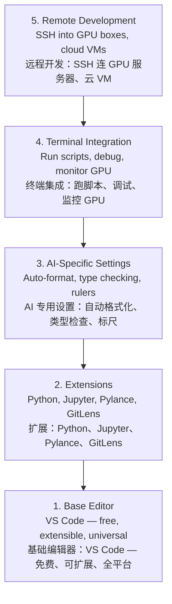

# Editor Setup

> 编辑器配置

> Your editor is your co-pilot. Configure it once so it stays out of your way and starts pulling its weight.
> 你的编辑器就是你的副驾驶。一次配好，以后它就不拖你后腿，开始发挥价值。

**Type:** Build

> **类型：** 构建

**Languages:** --

> **语言：** --

**Prerequisites:** Phase 0, Lesson 01

> **前置课程：** Phase 0, Lesson 01

**Time:** ~20 minutes

> **时间：** ~20 分钟

## Learning Objectives

> 学习目标

- Install VS Code with essential extensions for Python, Jupyter, linting, and remote SSH
  > 安装 VS Code 并配置 Python、Jupyter、linting 和远程 SSH 等核心扩展
- Configure format-on-save, type checking, and notebook output scrolling for AI workflows
  > 配置保存时自动格式化、类型检查和 notebook 输出滚动等 AI 工作流设置
- Set up Remote SSH to edit and debug code on remote GPU machines as if they were local
  > 配置 Remote SSH，像操作本地文件一样在远程 GPU 机器上编辑和调试代码
- Evaluate editor alternatives (Cursor, Windsurf, Neovim) and their tradeoffs for AI work
  > 评估编辑器替代品（Cursor、Windsurf、Neovim）及其在 AI 工作中的取舍

## The Problem

> 问题

You'll spend thousands of hours inside your editor writing Python, running notebooks, debugging training loops, and SSH-ing into GPU boxes. A misconfigured editor turns every session into friction: no autocomplete, no type hints, no inline errors, manual formatting, and a clunky terminal workflow.

> 你将在编辑器里度过几千个小时：写 Python、跑 notebook、调试训练循环、SSH 连 GPU 服务器。一个没配好的编辑器每次都会带来摩擦：没有自动补全、没有类型提示、没有行内错误、手动格式化、终端体验糟糕。

The right setup takes 20 minutes. Skipping it costs you 20 minutes every day.

> 正确配置只需 20 分钟。跳过它，每天浪费 20 分钟。

## The Concept

> 概念

An AI engineering editor setup needs five things:

> AI 工程编辑器配置需要五层：




## Build It

> 从零构建

### Step 1: Install VS Code

> 步骤 1：安装 VS Code

VS Code is the recommended editor. It is free, runs on every OS, has first-class Jupyter notebook support, and the extension ecosystem covers everything you need for AI work.

> VS Code 是推荐编辑器。免费、全平台、对 Jupyter notebook 有一流支持，扩展生态覆盖 AI 工作所需的一切。

Download it from [code.visualstudio.com](https://code.visualstudio.com/).

> 从 [code.visualstudio.com](https://code.visualstudio.com/) 下载。

Verify from the terminal:

> 在终端验证：

```bash
code --version
```

If `code` is not found on macOS, open VS Code, press `Cmd+Shift+P`, type "Shell Command", and select "Install 'code' command in PATH".

> 如果终端找不到 `code` 命令（macOS）：打开 VS Code，按 `Cmd+Shift+P`，输入 "Shell Command"，选择 "Install 'code' command in PATH"。

### Step 2: Install Essential Extensions

> 步骤 2：安装核心扩展

Open the integrated terminal in VS Code (`Ctrl+```  or `Cmd+``) and install the extensions that matter for AI work:

> 在 VS Code 集成终端（`Ctrl+``` ）中安装 AI 工作核心扩展：

```bash
code --install-extension ms-python.python~
code --install-extension ms-python.vscode-pylance
code --install-extension ms-toolsai.jupyter
code --install-extension eamodio.gitlens
code --install-extension ms-vscode-remote.remote-ssh
code --install-extension ms-python.debugpy
code --install-extension ms-python.black-formatter
code --install-extension charliermarsh.ruff
```

What each one does:

> 每个扩展的作用：

| Extension | Why |

> | 扩展 | 作用 |
> |-----------|-----|
> | Python | Language support, virtual env detection, run/debug |
> | Python | 语言支持，虚拟环境检测，运行/调试 |
> | Pylance | Fast type checking, autocomplete, import resolution |
> | Pylance | 快速类型检查，自动补全，import 解析 |
> | Jupyter | Run notebooks inside VS Code, variable explorer |
> | Jupyter | 在 VS Code 内运行 notebook，变量浏览器 |
> | GitLens | See who changed what, inline git blame |
> | GitLens | 查看每行代码谁改的，行内 git blame |
> | Remote SSH | Open a folder on a remote GPU box as if it were local |
> | Remote SSH | 像操作本地文件一样打开远程 GPU 服务器上的文件夹 |
> | Debugpy | Step-through debugging for Python |
> | Debugpy | Python 单步调试 |
> | Black Formatter | Auto-format on save, consistent style |
> | Black Formatter | 保存时自动格式化，风格统一 |
> | Ruff | Fast linting, catches common mistakes |
> | Ruff | 快速 linting，捕获常见错误 |

The file `code/.vscode/extensions.json` in this lesson contains the full recommendations list. When you open the project folder, VS Code will prompt you to install them.

> 本课程的 `code/.vscode/extensions.json` 包含完整推荐列表。打开项目文件夹时 VS Code 会提示安装。

### Step 3: Configure Settings

> 步骤 3：配置设置

Copy the settings from `code/.vscode/settings.json` in this lesson, or apply them manually through `Settings > Open Settings (JSON)`.

> 复制本课程 `code/.vscode/settings.json` 中的设置，或通过 `设置 > 打开设置 (JSON)` 手动应用。

The key settings for AI work:

> AI 工作关键设置：

```jsonc
{
    "python.analysis.typeCheckingMode": "basic",
    "editor.formatOnSave": true,
    "editor.rulers": [88, 120],
    "notebook.output.scrolling": true,
    "files.autoSave": "afterDelay"
}
```

Why these matter:

> 为什么重要：

- **Type checking on basic**: Catches wrong argument types before you run. Saves debugging time on tensor shape mismatches and wrong API parameters.
  > **基础类型检查**：在运行前捕获错误参数类型。省去因 tensor 形状不匹配和 API 参数错误而调试的时间。
- **Format on save**: Never think about formatting again. Black handles it.
  > **保存时格式化**：再也不用想格式问题。Black 帮你搞定。
- **Rulers at 88 and 120**: Black wraps at 88. The 120 marker shows when docstrings and comments are getting too long.
  > **88 和 120 字符标尺**：Black 在 88 字符处换行。120 字符标记提醒 docstring 和注释太长。
- **Notebook output scrolling**: Training loops print thousands of lines. Without scrolling, the output panel explodes.
  > **Notebook 输出滚动**：训练循环打印几千行。不滚动的输出面板会爆炸。
- **Auto-save**: You will forget to save. Your training script will run stale code. Auto-save prevents that.
  > **自动保存**：你肯定会忘记保存。然后训练脚本跑的是旧代码。自动保存杜绝这个。

### Step 4: Terminal Integration

> 步骤 4：终端集成

VS Code's integrated terminal is where you run training scripts, monitor GPUs, and manage environments.

> VS Code 的集成终端是你跑训练脚本、监控 GPU、管理环境的地方。

Set it up properly:

> 正确配置：

```jsonc
{
    "terminal.integrated.defaultProfile.osx": "zsh",
    "terminal.integrated.defaultProfile.linux": "bash",
    "terminal.integrated.fontSize": 13,
    "terminal.integrated.scrollback": 10000
}
```

Useful shortcuts:

> 常用快捷键：

| Action | macOS | Linux/Windows |

> | 操作 | macOS | Linux/Windows |
> |--------|-------|---------------|
> | Toggle terminal | `Ctrl+`` | `Ctrl+`` |
> | 开关终端 | `Ctrl+`` | `Ctrl+`` |
> | New terminal | `Ctrl+Shift+```  | `Ctrl+Shift+```  |
> | 新建终端 | `Ctrl+Shift+```  | `Ctrl+Shift+```  |
> | Split terminal | `Cmd+\` | `Ctrl+\` |
> | 拆分终端 | `Cmd+\` | `Ctrl+\` |

Split terminals are useful: one for running your script, one for monitoring GPU with `nvidia-smi -l 1` or `watch -n 1 nvidia-smi`.

> 拆分终端很实用：一边跑脚本，一边用 `nvidia-smi -l 1` 监控 GPU。

### Step 5: Remote Development (SSH into GPU Boxes)

> 步骤 5：远程开发（SSH 连 GPU 服务器）

This is the most important extension for AI work. You will run training on remote machines (cloud VMs, lab servers, Lambda, Vast.ai). Remote SSH lets you open the remote filesystem, edit files, run terminals, and debug as if everything were local.

> 这是 AI 工作最重要的扩展。你会需要在远程机器（云 VM、实验室服务器、Lambda、Vast.ai）上跑训练。Remote SSH 让你像操作本地文件一样操作远程文件系统——编辑、终端、调试，一切如本地。

Setup:

> 配置：

1. Install the Remote SSH extension (done in Step 2).

> 装好 Remote SSH 扩展（步骤 2 已做）。
>
> 1. Press `Ctrl+Shift+P` (or `Cmd+Shift+P`), type "Remote-SSH: Connect to Host".
>
> 按 `Ctrl+Shift+P`，输入 "Remote-SSH: Connect to Host"。
>
> 1. Enter `user@your-gpu-box-ip`.
>
> 输入 `user@你的GPU服务器IP`。
>
> 1. VS Code installs its server component on the remote machine automatically.
>
> VS Code 会自动在远程机器上安装服务端组件。

For passwordless access, set up SSH keys:

> 配置免密登录：

```bash
ssh-keygen -t ed25519 -C "your-email@example.com"
ssh-copy-id user@your-gpu-box-ip
```

Add the host to `~/.ssh/config` for convenience:

> 将主机加入 `~/.ssh/config` 方便使用：

```
Host gpu-box
    HostName 203.0.113.50
    User ubuntu
    IdentityFile ~/.ssh/id_ed25519
    ForwardAgent yes
```

Now `Remote-SSH: Connect to Host > gpu-box` connects instantly.

> 之后 `Remote-SSH: Connect to Host > gpu-box` 秒连。

## Alternatives

> 替代品

### Cursor

> Cursor

[cursor.com](https://cursor.com) is a VS Code fork with built-in AI code generation. It uses the same extension ecosystem and settings format. If you use Cursor, everything in this lesson still applies. Import the same `settings.json` and `extensions.json`.

> [cursor.com](https://cursor.com) 是 VS Code 的分支，内置 AI 代码生成。使用相同的扩展生态和设置格式。如果用 Cursor，本课所有内容仍然适用。导入相同的 `settings.json` 和 `extensions.json` 即可。

### Windsurf

> Windsurf

[windsurf.com](https://windsurf.com) is another AI-first VS Code fork. Same story: same extensions, same settings format, same Remote SSH support.

> [windsurf.com](https://windsurf.com) 是另一个 AI 优先的 VS Code 分支。同样：相同扩展、相同设置格式、相同 Remote SSH 支持。

### Vim/Neovim

> Vim/Neovim

If you already use Vim or Neovim and are productive in it, stay there. The minimum setup for AI Python work:

> 如果你已经在用 Vim 或 Neovim 且效率很高，继续用。AI Python 工作最低配置：

- **pyright** or **pylsp** for type checking (via Mason or manual install)
  > **pyright** 或 **pylsp** 做类型检查（通过 Mason 或手动安装）
- **nvim-lspconfig** for language server integration
  > **nvim-lspconfig** 做语言服务器集成
- **jupyter-vim** or **molten-nvim** for notebook-like execution
  > **jupyter-vim** 或 **molten-nvim** 做类 notebook 执行
- **telescope.nvim** for file/symbol search
  > **telescope.nvim** 做文件/符号搜索
- **none-ls.nvim** with black and ruff for formatting/linting
  > **none-ls.nvim** 配合 black 和 ruff 做格式化/linting

If you do not already use Vim, do not start now. The learning curve will compete with learning AI engineering. Use VS Code.

> 如果你还不会 Vim，现在别学。它的学习曲线会和你学 AI 工程打架。用 VS Code。

## Use It

> 实际使用

With this setup, your daily workflow looks like:

> 配好后，你的日常工作流：

1. Open the project folder in VS Code (or connect via Remote SSH to a GPU box).

> 在 VS Code 中打开项目文件夹（或通过 Remote SSH 连 GPU 服务器）。
>
> 1. Write Python in the editor with autocomplete, type hints, and inline errors.
>
> 写 Python，有自动补全、类型提示、行内错误。
>
> 1. Run Jupyter notebooks inline with the Jupyter extension.
>
> 用 Jupyter 扩展内联运行 notebook。
>
> 1. Use the integrated terminal for training scripts, `uv pip install`, and GPU monitoring.
>
> 用集成终端跑训练脚本、`uv pip install`、监控 GPU。
>
> 1. Review changes with GitLens before committing.
>
> 提交前用 GitLens 回顾改动。

## Exercises

> 练习

1. Install VS Code and all extensions listed in Step 2

> 安装 VS Code 和步骤 2 列出的所有扩展
>
> 1. Copy the `settings.json` from this lesson into your VS Code config
>
> 将本课的 `settings.json` 复制到你的 VS Code 配置中
>
> 1. Open a Python file and verify that Pylance shows type hints and Black formats on save
>
> 打开一个 Python 文件，验证 Pylance 显示类型提示、Black 在保存时格式化
>
> 1. If you have access to a remote machine, set up Remote SSH and open a folder on it
>
> 如果有远程机器访问权限，配置 Remote SSH 并打开远程文件夹

## Key Terms

> 关键术语

| Term | What people say | What it actually means |

> | 术语 | 人们常怎么说 | 实际含义 |
> |------|----------------|----------------------|
> | LSP | "Autocomplete engine" | Language Server Protocol: a standard for editors to get type info, completions, and diagnostics from a language-specific server |
> | LSP | "自动补全引擎" | 语言服务器协议：编辑器从语言服务器获取类型信息、补全和诊断的标准协议 |
> | Pylance | "The Python plugin" | Microsoft's Python language server using Pyright for type checking and IntelliSense |
> | Pylance | "Python 插件" | 微软的 Python 语言服务器，使用 Pyright 做类型检查和智能提示 |
> | Remote SSH | "Working on the server" | VS Code extension that runs a lightweight server on a remote machine and streams the UI to your local editor |
> | Remote SSH | "在服务器上干活" | VS Code 扩展，在远程机器上运行轻量服务器，将 UI 流式传输到本地编辑器 |
> | Format on save | "Auto-prettier" | The editor runs a formatter (Black, Ruff) every time you save, so code style is always consistent |
> | 保存时格式化 | "自动美化" | 编辑器在每次保存时运行格式化工具（Black、Ruff），代码风格始终一致 |

