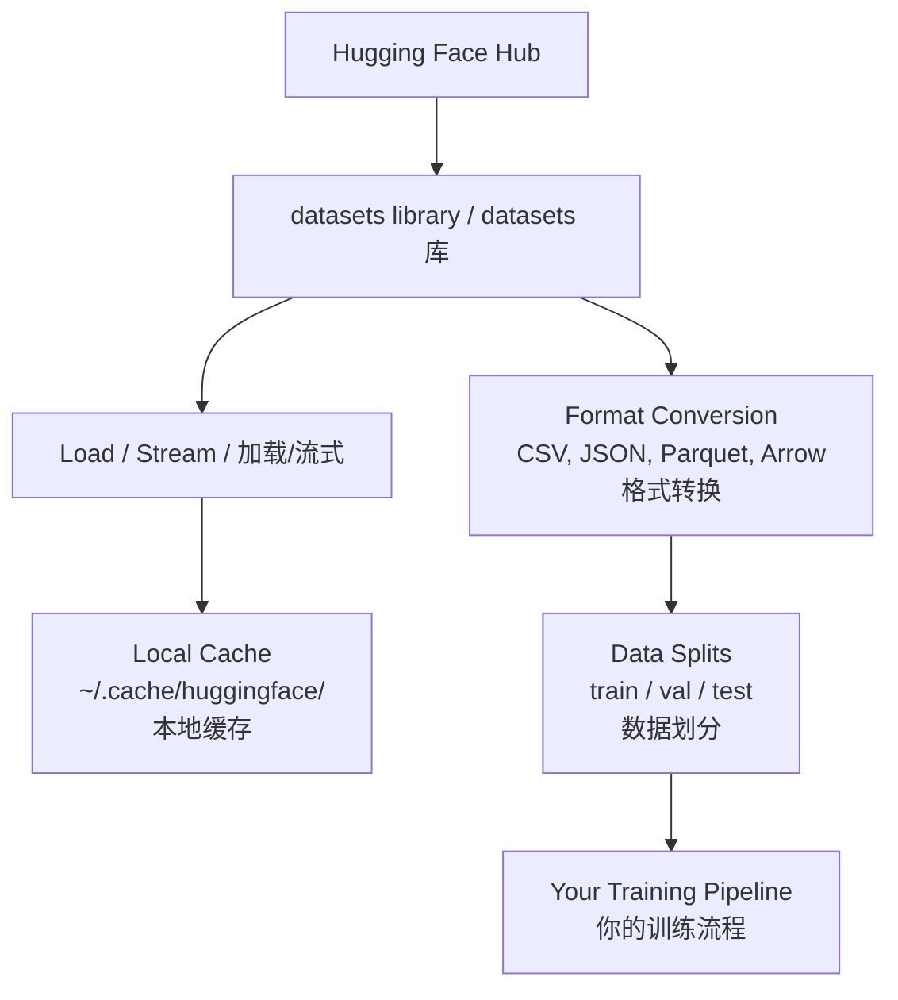

# Data Management
> 数据管理

> Data is the fuel. How you manage it determines how fast you go.
> 数据是燃料。你怎么管理它，决定了你能跑多快。

**Type:** Build
> **类型：** 构建

**Language:** Python
> **语言：** Python

**Prerequisites:** Phase 0, Lesson 01
> **前置课程：** Phase 0, Lesson 01

**Time:** ~45 minutes
> **时间：** ~45 分钟

## Learning Objectives
> 学习目标

- Load, stream, and cache datasets using the Hugging Face `datasets` library
> 使用 Hugging Face `datasets` 库加载、流式读取和缓存数据集
- Convert between CSV, JSON, Parquet, and Arrow formats and explain their tradeoffs
> 在 CSV、JSON、Parquet 和 Arrow 格式之间转换，解释各自的取舍
- Create reproducible train/validation/test splits with fixed random seeds
> 使用固定随机种子创建可复现的训练/验证/测试集划分
- Manage large model and dataset files using `.gitignore`, Git LFS, or DVC
> 使用 `.gitignore`、Git LFS 或 DVC 管理大型模型和数据集文件

## The Problem
> 问题

Every AI project starts with data. You need to find datasets, download them, convert between formats, split them for training and evaluation, and version them so experiments are reproducible. Doing this manually every time is slow and error-prone. You need a repeatable workflow.
> 每个 AI 项目都始于数据。你需要找数据集、下载、格式转换、划分训练集和评估集，还要做版本管理以保证实验可复现。每次手动做这些事情又慢又容易出错。你需要一套可重复的工作流。

## The Concept
> 概念



The Hugging Face `datasets` library is the standard way to load data for AI work. It handles downloading, caching, format conversion, and streaming out of the box.
> Hugging Face `datasets` 库是 AI 工作中加载数据的标准方式。它开箱即用地处理下载、缓存、格式转换和流式读取。

## Build It
> 从零构建

### Step 1: Install the datasets library
> 步骤 1：安装 datasets 库

```bash
pip install datasets huggingface_hub
```

### Step 2: Load a dataset
> 步骤 2：加载数据集

```python
from datasets import load_dataset

dataset = load_dataset("imdb")
print(dataset)
print(dataset["train"][0])
```

This downloads the IMDB movie review dataset. After the first download, it loads from cache at `~/.cache/huggingface/datasets/`.
> 这会把 IMDB 电影评论数据集下载到本地。首次下载后，后续加载都从缓存 `~/.cache/huggingface/datasets/` 读取。

### Step 3: Stream large datasets
> 步骤 3：流式读取大型数据集

Some datasets are too large to fit on disk. Streaming loads them row by row without downloading the full thing.
> 有些数据集太大，装不进硬盘。流式模式逐行加载，不需要下载完整数据集。

```python
dataset = load_dataset("wikimedia/wikipedia", "20220301.en", split="train", streaming=True)

for i, example in enumerate(dataset):
    print(example["title"])
    if i >= 4:
        break
```

Streaming gives you an `IterableDataset`. You process rows as they arrive. Memory usage stays constant regardless of dataset size.
> 流式模式返回 `IterableDataset`。数据逐行到达就逐行处理。无论数据集多大，内存占用保持恒定。

### Step 4: Dataset formats
> 步骤 4：数据集格式

The `datasets` library uses Apache Arrow under the hood. You can convert to other formats depending on what your pipeline needs.
> `datasets` 库底层使用 Apache Arrow。你可以根据流程需要转换为其他格式。

```python
dataset = load_dataset("imdb", split="train")

dataset.to_csv("imdb_train.csv")
dataset.to_json("imdb_train.json")
dataset.to_parquet("imdb_train.parquet")
```

Format comparison:
> 格式对比：

| Format | Size | Read Speed | Best For |
> | 格式 | 大小 | 读取速度 | 最适合 |
|--------|------|-----------|----------|
| CSV | Large | Slow | Human readability, spreadsheets |
> | CSV | 大 | 慢 | 人类可读、电子表格 |
| JSON | Large | Slow | APIs, nested data |
> | JSON | 大 | 慢 | API 交互、嵌套数据 |
| Parquet | Small | Fast | Analytics, columnar queries |
> | Parquet | 小 | 快 | 数据分析、列式查询 |
| Arrow | Small | Fastest | In-memory processing (what `datasets` uses internally) |
> | Arrow | 小 | 最快 | 内存中处理（`datasets` 内部使用的格式） |

For AI work, Parquet is the best storage format. Arrow is what you work with in memory. CSV and JSON are for interchange.
> AI 工作中，Parquet 是存储最优格式。Arrow 是内存中操作格式。CSV 和 JSON 用于数据交换。

### Step 5: Data splits
> 步骤 5：数据划分

Every ML project needs three splits:
> 每个 ML 项目都需要三种划分：

- **Train**: The model learns from this (typically 80%)
> **训练集**：模型从这里学习（通常 80%）
- **Validation**: You check progress during training (typically 10%)
> **验证集**：训练过程中检查进度（通常 10%）
- **Test**: Final evaluation after training is done (typically 10%)
> **测试集**：训练完后的最终评估（通常 10%）

Some datasets come pre-split. When they don't, split them yourself:
> 有些数据集自带划分。没有的话自己分：

```python
dataset = load_dataset("imdb", split="train")

split = dataset.train_test_split(test_size=0.2, seed=42)
train_val = split["train"].train_test_split(test_size=0.125, seed=42)

train_ds = train_val["train"]   # 80%
val_ds = train_val["test"]       # 10%
test_ds = split["test"]          # 10%

print(f"Train: {len(train_ds)}, Val: {len(val_ds)}, Test: {len(test_ds)}")
```

Always set a seed for reproducibility. The same seed produces the same split every time.
> 始终设置 seed 确保可复现。同样的 seed 每次产生同样的划分。

### Step 6: Download and cache models
> 步骤 6：下载和缓存模型

Models are large files. The `huggingface_hub` library handles downloading and caching.
> 模型是大文件。`huggingface_hub` 库处理下载和缓存。

```python
from huggingface_hub import hf_hub_download, snapshot_download

model_path = hf_hub_download(
    repo_id="sentence-transformers/all-MiniLM-L6-v2",
    filename="config.json"
)
print(f"Cached at: {model_path}")

model_dir = snapshot_download("sentence-transformers/all-MiniLM-L6-v2")
print(f"Full model at: {model_dir}")
```

Models cache to `~/.cache/huggingface/hub/`. Once downloaded, they load instantly on subsequent runs.
> 模型缓存到 `~/.cache/huggingface/hub/`。下载一次后，后续加载秒开。

### Step 7: Handle large files
> 步骤 7：处理大文件

Model weights and large datasets should not go into git. Three options:
> 模型权重和大型数据集不该进 git。三种方案：

**Option A: .gitignore (simplest)**
> 方案 A：.gitignore（最简单）

```
*.bin
*.safetensors
*.pt
*.onnx
data/*.parquet
data/*.csv
models/
```

**Option B: Git LFS (track large files in git)**
> 方案 B：Git LFS（在 git 中追踪大文件）

```bash
git lfs install
git lfs track "*.bin"
git lfs track "*.safetensors"
git add .gitattributes
```

Git LFS stores pointers in your repo and the actual files on a separate server. GitHub gives you 1 GB free.
> Git LFS 在仓库中存指针，实际文件存在独立服务器上。GitHub 免费提供 1 GB。

**Option C: DVC (data version control)**
> 方案 C：DVC（数据版本控制）

```bash
pip install dvc
dvc init
dvc add data/training_set.parquet
git add data/training_set.parquet.dvc data/.gitignore
git commit -m "Track training data with DVC"
```

DVC creates small `.dvc` files that point to your data. The data itself lives in S3, GCS, or another remote storage backend.
> DVC 创建小型 `.dvc` 文件指向数据。数据本身存在 S3、GCS 等远程存储中。

| Approach | Complexity | Best For |
> | 方案 | 复杂度 | 最适合 |
|----------|-----------|----------|
| .gitignore | Low | Personal projects, downloaded data you can re-fetch |
> | .gitignore | 低 | 个人项目，可重新下载的数据 |
| Git LFS | Medium | Teams sharing model weights via git |
> | Git LFS | 中 | 团队通过 git 共享模型权重 |
| DVC | High | Reproducible experiments, large datasets, teams |
> | DVC | 高 | 可复现实验、大数据集、团队协作 |

For this course, `.gitignore` is enough. Use DVC when you need to reproduce exact experiments across machines.
> 本课程用 `.gitignore` 就够了。需要在多台机器上复现精确实验时再用 DVC。

### Step 8: Storage patterns
> 步骤 8：存储模式

**Local storage** works for datasets under ~10 GB. The HF cache handles this automatically.
> **本地存储** 适用于 ~10 GB 以下的数据集。HF 缓存自动处理。

**Cloud storage** is for anything larger or shared across machines:
> **云存储** 用于更大或跨机器共享的数据：

```python
import os

local_path = os.path.expanduser("~/.cache/huggingface/datasets/")

# s3_path = "s3://my-bucket/datasets/"
# gcs_path = "gs://my-bucket/datasets/"
```

DVC integrates with S3 and GCS directly:
> DVC 直接集成 S3 和 GCS：

```bash
dvc remote add -d myremote s3://my-bucket/dvc-store
dvc push
```

For this course, local storage is sufficient. Cloud storage becomes relevant when you fine-tune on remote GPU instances.
> 本课程本地存储就够了。在远程 GPU 实例上微调时才会用到云存储。

## Datasets Used in This Course

| Dataset | Lessons | Size | What It Teaches |
|---------|---------|------|----------------|
| IMDB | Tokenization, classification | 84 MB | Text classification basics |
| WikiText | Language modeling | 181 MB | Next-token prediction |
| SQuAD | QA systems | 35 MB | Question answering, spans |
| Common Crawl (subset) | Embeddings | Varies | Large-scale text processing |
| MNIST | Vision basics | 21 MB | Image classification fundamentals |
| COCO (subset) | Multimodal | Varies | Image-text pairs |

You do not need to download all of these now. Each lesson specifies what it needs.

## Use It

Run the utility script to verify everything works:

```bash
python code/data_utils.py
```

This downloads a small dataset, converts it, splits it, and prints a summary.

## Ship It

This lesson produces:
- `code/data_utils.py` - reusable data loading and caching utility
- `outputs/prompt-data-helper.md` - prompt for finding the right dataset for a task

## Exercises

1. Load the `glue` dataset with the `mrpc` config and inspect the first 5 examples
2. Stream the `c4` dataset and count how many examples you can process in 10 seconds
3. Convert a dataset to Parquet and compare the file size to CSV
4. Create a 70/15/15 train/val/test split with a fixed seed and verify the sizes

## Key Terms

| Term | What people say | What it actually means |
|------|----------------|----------------------|
| Dataset split | "Training data" | A named subset (train/val/test) used at different stages of the ML lifecycle |
| Streaming | "Load it lazily" | Processing data row by row from a remote source without downloading the full dataset |
| Parquet | "Compressed CSV" | A columnar file format optimized for analytical queries and storage efficiency |
| Arrow | "Fast dataframe" | An in-memory columnar format used internally by the datasets library for zero-copy reads |
| Git LFS | "Git for big files" | An extension that stores large files outside the git repo while keeping pointers in version control |
| DVC | "Git for data" | A version control system for datasets and models that integrates with cloud storage |
| Cache | "Already downloaded" | A local copy of previously fetched data, stored at ~/.cache/huggingface/ by default |
