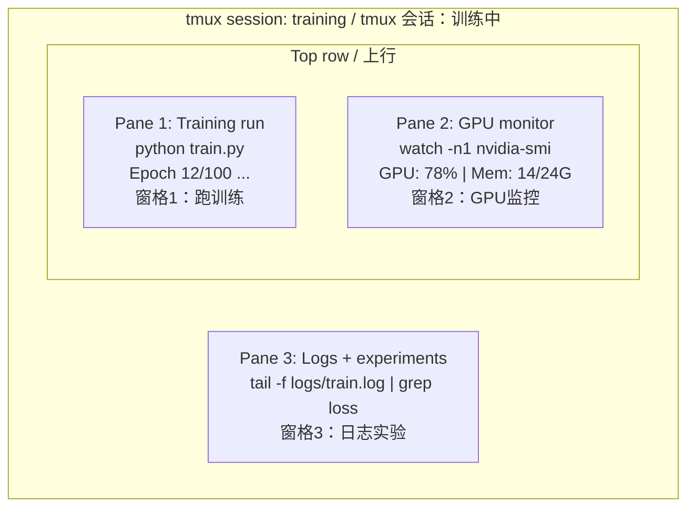

# Terminal & Shell
> 终端与 Shell

> The terminal is where AI engineers live. Get comfortable here.
> 终端是 AI 工程师的"家"。在这里待舒服。

**Type:** Learn
> **类型：** 学习

**Languages:** --
> **语言：** --

**Prerequisites:** Phase 0, Lesson 01
> **前置课程：** Phase 0, Lesson 01

**Time:** ~35 minutes
> **时间：** ~35 分钟

## Learning Objectives
> 学习目标

- Use piping, redirects, and `grep` to filter and process training logs from the command line
> 使用管道、重定向和 `grep` 在命令行中过滤和处理训练日志
- Create persistent tmux sessions with multiple panes for concurrent training and GPU monitoring
> 创建持久化的 tmux 会话，多窗格同时跑训练和监控 GPU
- Monitor system and GPU resources with `htop`, `nvtop`, and `nvidia-smi`
> 使用 `htop`、`nvtop` 和 `nvidia-smi` 监控系统和 GPU 资源
- Transfer files between local and remote machines using SSH, `scp`, and `rsync`
> 使用 SSH、`scp` 和 `rsync` 在本地和远程机器间传输文件

## The Problem
> 问题

You will spend more time in the terminal than in any editor. Training runs, GPU monitoring, log tailing, remote SSH sessions, environment management. Every AI workflow touches the shell. If you're slow here, you're slow everywhere.
> 你在终端里的时间会超过任何编辑器。跑训练、监控 GPU、tail 日志、远程 SSH、环境管理——每个 AI 工作流都要经过 Shell。这里慢，处处慢。

This lesson covers the terminal skills that matter for AI work. No history of Unix. No deep-dive into Bash scripting. Just what you need.
> 这节课只讲 AI 工作需要的终端技能。不讲 Unix 历史，不讲 Bash 脚本编程。只讲你需要的。

## The Concept
> 概念



Three things running at once. One terminal. You can detach, go home, SSH back in, and reattach. The training keeps running.
> 三个任务同时跑，一个终端。你可以 detach 断开、回家、SSH 连回来、重新接上。训练一直在跑。

## Build It
> 从零构建

### Step 1: Know your shell
> 步骤 1：认识你的 Shell

Check which shell you're running:
> 看看你用的是哪个 Shell：

```bash
echo $SHELL
```

Most systems use `bash` or `zsh`. Both work fine. The commands in this course work in either.
> 大多数系统用 `bash` 或 `zsh`。都行。本课程的命令两者通用。

Key things to know:
> 必须知道的：

```bash
# Move around / 目录导航
cd ~/projects/ai-engineering-from-scratch
pwd
ls -la

# History search (most useful shortcut you'll learn)
# Ctrl+R then type part of a previous command
# Press Ctrl+R again to cycle through matches
# 历史搜索（你学到的最有用的快捷键）
# Ctrl+R 然后输入之前命令的一部分
# 再按 Ctrl+R 循环匹配项

# Clear terminal / 清屏
clear   # or Ctrl+L / 或 Ctrl+L

# Cancel a running command / 取消正在运行的命令
# Ctrl+C

# Suspend a running command (resume with fg) / 暂停命令（fg 恢复）
# Ctrl+Z
```

### Step 2: Piping and redirects
> 步骤 2：管道和重定向

Piping connects commands together. This is how you process logs, filter output, and chain tools. You will use this constantly.
> 管道把命令串起来。处理日志、过滤输出、串联工具都靠它。你会天天用。

```bash
# Count how many times "loss" appears in a log
# 统计日志中 "loss" 出现多少次
cat train.log | grep "loss" | wc -l

# Extract just the loss values from training output
# 从训练输出中只提取 loss 值
grep "loss:" train.log | awk '{print $NF}' > losses.txt

# Watch a log file update in real time, filtering for errors
# 实时查看日志更新，只过滤错误
tail -f train.log | grep --line-buffered "ERROR"

# Sort experiments by final accuracy
# 按最终准确率排序实验
grep "final_accuracy" results/*.log | sort -t= -k2 -n -r

# Redirect stdout and stderr to separate files
# stdout 和 stderr 分别重定向到不同文件
python train.py > output.log 2> errors.log

# Redirect both to the same file
# 两者重定向到同一个文件
python train.py > train_full.log 2>&1
```

The three redirects you need:
> 你需要的重定向符号：

| Symbol | What it does |
> | 符号 | 作用 |
|--------|-------------|
| `>` | Write stdout to file (overwrite) |
> | `>` | 将 stdout 写入文件（覆盖） |
| `>>` | Append stdout to file |
> | `>>` | 将 stdout 追加到文件末尾 |
| `2>` | Write stderr to file |
> | `2>` | 将 stderr 写入文件 |
| `2>&1` | Send stderr to same place as stdout |
> | `2>&1` | 把 stderr 送到 stdout 去的地方 |
| `\|` | Send stdout of one command as stdin to the next |
> | `\|` | 把前一个命令的 stdout 作为后一个命令的 stdin |

### Step 3: Background processes
> 步骤 3：后台进程

Training runs take hours. You don't want to keep your terminal open the whole time.
> 训练要跑几小时。你不想一直开着终端。

```bash
# Run in background (output still goes to terminal)
# 后台运行（输出仍显示在终端）
python train.py &

# Run in background, immune to hangup (closing terminal won't kill it)
# 后台运行，不受终端关闭影响
nohup python train.py > train.log 2>&1 &

# Check what's running in background / 查看后台运行了什么
jobs
ps aux | grep train.py

# Bring a background job to foreground / 把后台任务拉回前台
fg %1

# Kill a background process / 杀掉后台进程
kill %1
# or find its PID and kill that / 或找到 PID 杀掉
kill $(pgrep -f "train.py")
```

The difference between `&`, `nohup`, and `screen`/`tmux`:
> `&`、`nohup`、`screen`/`tmux` 的区别：

| Method | Survives terminal close? | Can reattach? |
> | 方法 | 关终端还活着？ | 能重新接入？ |
|--------|-------------------------|---------------|
| `command &` | No / 不行 | No / 不行 |
| `nohup command &` | Yes / 行 | No (check log file) / 不行（看日志文件） |
| `screen` / `tmux` | Yes / 行 | Yes / 行 |

For anything longer than a few minutes, use tmux.
> 超过几分钟的任务，用 tmux。

### Step 4: tmux
> 步骤 4：tmux

tmux lets you create persistent terminal sessions with multiple panes. This is the single most useful tool for managing training runs.
> tmux 让你创建持久化终端会话，一个窗口多窗格。这是管理训练任务最有用的工具。

```bash
# Install / 安装
# macOS
brew install tmux
# Ubuntu
sudo apt install tmux

# Start a named session / 创建命名会话
tmux new -s training

# Split horizontally / 水平分屏
# Ctrl+B then " / Ctrl+B 然后按 "

# Split vertically / 垂直分屏
# Ctrl+B then % / Ctrl+B 然后按 %

# Navigate between panes / 窗格间切换
# Ctrl+B then arrow keys / Ctrl+B 然后方向键

# Detach (session keeps running) / 分离（会话继续跑）
# Ctrl+B then d / Ctrl+B 然后按 d

# Reattach / 重新接入
tmux attach -t training

# List sessions / 列出所有会话
tmux ls

# Kill a session / 杀掉会话
tmux kill-session -t training
```

A typical AI workflow session:
> 典型 AI 工作流会话：

```bash
tmux new -s train

# Pane 1: start training / 窗格1：启动训练
python train.py --epochs 100 --lr 1e-4

# Ctrl+B, " to split, then run GPU monitor
# Ctrl+B, " 分屏，开 GPU 监控
watch -n1 nvidia-smi

# Ctrl+B, % to split vertically, tail the logs
# Ctrl+B, % 垂直分屏，tail 日志
tail -f logs/experiment.log

# Now detach with Ctrl+B, d
# SSH out, go get coffee, come back
# tmux attach -t train
# 现在 Ctrl+B, d 分离
# SSH 断开，去喝杯咖啡，回来
# tmux attach -t train 重新连上
```

### Step 5: Monitoring with htop and nvtop
> 步骤 5：用 htop 和 nvtop 监控

```bash
# System processes (better than top) / 系统进程（比 top 好看）
htop

# GPU processes (if you have NVIDIA GPU)
# Install: sudo apt install nvtop (Ubuntu) or brew install nvtop (macOS)
# GPU 进程（有 NVIDIA GPU 的话）
# 安装：sudo apt install nvtop（Ubuntu）或 brew install nvtop（macOS）
nvtop

# Quick GPU check without nvtop / 没有 nvtop 时快速查看 GPU
nvidia-smi

# Watch GPU usage update every second / 每秒刷新 GPU 使用情况
watch -n1 nvidia-smi

# See which processes are using the GPU / 看哪些进程在用 GPU
nvidia-smi --query-compute-apps=pid,name,used_memory --format=csv
```

`htop` keybindings you'll use:
> `htop` 常用快捷键：

- `F6` or `>` to sort by column (sort by memory to find memory leaks)
> `F6` 或 `>` 按列排序（按内存排序找内存泄漏）
- `F5` to toggle tree view (see child processes)
> `F5` 切换树状视图（看子进程）
- `F9` to kill a process
> `F9` 杀进程
- `/` to search for a process name
> `/` 搜索进程名

### Step 6: SSH for remote GPU boxes
> 步骤 6：SSH 连远程 GPU

When you rent a cloud GPU (Lambda, RunPod, Vast.ai), you connect via SSH.
> 租云 GPU（Lambda、RunPod、Vast.ai）时，通过 SSH 连接。

```bash
# Basic connection / 基本连接
ssh user@gpu-box-ip

# With a specific key / 指定密钥
ssh -i ~/.ssh/my_gpu_key user@gpu-box-ip

# Copy files to remote / 传文件到远程
scp model.pt user@gpu-box-ip:~/models/

# Copy files from remote / 从远程拉文件
scp user@gpu-box-ip:~/results/metrics.json ./

# Sync a whole directory (faster for many files)
# 同步整个目录（文件多时更快）
rsync -avz ./data/ user@gpu-box-ip:~/data/

# Port forward (access remote Jupyter/TensorBoard locally)
# 端口转发（本地访问远程 Jupyter/TensorBoard）
ssh -L 8888:localhost:8888 user@gpu-box-ip
# Now open localhost:8888 in your browser
# 然后在浏览器打开 localhost:8888

# SSH config for convenience / SSH 配置简化连接
# Add to ~/.ssh/config: / 添加到 ~/.ssh/config：
# Host gpu
#     HostName 192.168.1.100
#     User ubuntu
#     IdentityFile ~/.ssh/gpu_key
#
# Then just: / 然后只需要：
# ssh gpu
```

### Step 7: Useful aliases for AI work
> 步骤 7：AI 工作常用别名

Add these to your `~/.bashrc` or `~/.zshrc`:
> 把这些加到 `~/.bashrc` 或 `~/.zshrc`：

```bash
source phases/00-setup-and-tooling/10-terminal-and-shell/code/shell_aliases.sh
```

Or copy the ones you want. The key aliases:
> 或者只复制你需要的。核心别名：

```bash
# GPU status at a glance / 一眼看 GPU 状态
alias gpu='nvidia-smi --query-gpu=index,name,utilization.gpu,memory.used,memory.total,temperature.gpu --format=csv,noheader'

# Kill all Python training processes / 杀掉所有 Python 训练进程
alias killtraining='pkill -f "python.*train"'

# Quick virtual environment activate / 快速激活虚拟环境
alias ae='source .venv/bin/activate'

# Watch training loss / 实时看训练 loss
alias watchloss='tail -f logs/*.log | grep --line-buffered "loss"'
```

See `code/shell_aliases.sh` for the full set.
> 完整列表见 `code/shell_aliases.sh`。

### Step 8: Common AI terminal patterns
> 步骤 8：AI 终端常用模式

These come up repeatedly in practice:
> 实践中反复出现的操作：

```bash
# Run training, log everything, notify when done
# 跑训练、记录一切、完成后通知
python train.py 2>&1 | tee train.log; echo "DONE" | mail -s "Training complete" you@email.com

# Compare two experiment logs side by side
# 并排比较两个实验日志
diff <(grep "accuracy" exp1.log) <(grep "accuracy" exp2.log)

# Find the largest model files (clean up disk space)
# 找最大的模型文件（清理磁盘）
find . -name "*.pt" -o -name "*.safetensors" | xargs du -h | sort -rh | head -20

# Download a model from Hugging Face
# 从 Hugging Face 下载模型
wget https://huggingface.co/model/resolve/main/model.safetensors

# Untar a dataset / 解压数据集
tar xzf dataset.tar.gz -C ./data/

# Count lines in all Python files (see how big your project is)
# 统计所有 Python 文件行数（看项目多大）
find . -name "*.py" | xargs wc -l | tail -1

# Check disk space (training data fills disks fast)
# 检查磁盘空间（训练数据很快填满磁盘）
df -h
du -sh ./data/*

# Environment variable check before training
# 训练前检查环境变量
env | grep -i cuda
env | grep -i torch
```

## Use It
> 实际使用

Here's when each tool comes into play during this course:
> 各工具在后续课程中的使用时机：

| Tool | When you use it |
> | 工具 | 使用时机 |
|------|----------------|
| tmux | Every training run (Phases 3+) |
> | tmux | 每次训练时（Phase 3+） |
| `tail -f` + `grep` | Monitoring training logs |
> | `tail -f` + `grep` | 监控训练日志 |
| `nohup` / `&` | Quick background tasks |
> | `nohup` / `&` | 快速后台任务 |
| `htop` / `nvtop` | Debugging slow training, OOM errors |
> | `htop` / `nvtop` | 调试训练慢、OOM 错误 |
| SSH + `rsync` | Working on cloud GPUs |
> | SSH + `rsync` | 用云 GPU 时 |
| Piping + redirects | Processing experiment results |
> | 管道 + 重定向 | 处理实验结果 |
| Aliases | Saving time on repetitive commands |
> | 别名 | 省重复命令时间 |

## Exercises
> 练习

1. Install tmux, create a session with three panes, and run `htop` in one, `watch -n1 date` in another, and a Python script in the third. Detach and reattach.
> 装 tmux，创建三窗格会话，分别跑 `htop`、`watch -n1 date` 和 Python 脚本。分离后再接入。
2. Add the aliases from `code/shell_aliases.sh` to your shell config and reload with `source ~/.zshrc` (or `~/.bashrc`).
> 把 `code/shell_aliases.sh` 的别名加到 Shell 配置里，`source ~/.zshrc`（或 `~/.bashrc`）重载。
3. Create a fake training log with `for i in $(seq 1 100); do echo "epoch $i loss: $(echo "scale=4; 1/$i" | bc)"; sleep 0.1; done > fake_train.log` and then use `grep`, `tail`, and `awk` to extract just the loss values.
> 生成假训练日志，用 `grep`、`tail`、`awk` 只提取 loss 值。
4. Set up an SSH config entry for a server you have access to (or use `localhost` to practice the syntax).
> 为能访问的服务器写一个 SSH config 条目（或拿 `localhost` 练语法）。

## Key Terms
> 关键术语

| Term | What people say | What it actually means |
> | 术语 | 人们常怎么说 | 实际含义 |
|------|----------------|----------------------|
| Shell | "The terminal" | The program that interprets your commands (bash, zsh, fish) |
> | Shell | "终端" | 解释你输入的命令的程序（bash、zsh、fish） |
| tmux | "Terminal multiplexer" | A program that lets you run multiple terminal sessions inside one window, and detach/reattach |
> | tmux | "终端复用器" | 让你在一个窗口跑多个终端会话，还能分离/重新接入 |
| Pipe | "The bar thing" | The `\|` operator that sends one command's output as input to another |
> | 管道 | "那个竖线" | `\|` 操作符，把前一个命令的输出作为后一个命令的输入 |
| PID | "Process ID" | A unique number assigned to every running process, used to monitor or kill it |
> | PID | "进程 ID" | 每个运行进程的唯一编号，用于监控或杀死它 |
| nohup | "No hangup" | Runs a command immune to the hangup signal, so closing the terminal won't kill it |
> | nohup | "不挂断" | 让命令忽略挂断信号，关终端也不会被杀掉 |
| SSH | "Connecting to the server" | Secure Shell, an encrypted protocol for running commands on a remote machine |
> | SSH | "连服务器" | 安全 Shell，加密协议，用于在远程机器上执行命令 |
