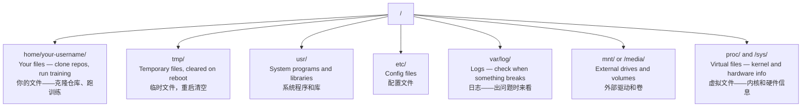

# Linux for AI
> AI 开发者的 Linux

> Most AI runs on Linux. You need to know enough to not be stuck.
> 大部分 AI 跑在 Linux 上。你不需要成为专家，但得知道足够不卡住。

**Type:** Learn
> **类型：** 学习

**Languages:** --
> **语言：** --

**Prerequisites:** Phase 0, Lesson 01
> **前置课程：** Phase 0, Lesson 01

**Time:** ~30 minutes
> **时间：** ~30 分钟

## Learning Objectives
> 学习目标

- Navigate the Linux file system and perform essential file operations from the command line
> 在 Linux 文件系统中导航，从命令行执行基本文件操作
- Manage file permissions with `chmod` and `chown` to resolve "Permission denied" errors
> 用 `chmod` 和 `chown` 管理文件权限，解决 "Permission denied" 错误
- Install system packages with `apt` and set up a fresh GPU box for AI work
> 用 `apt` 安装系统包，配置一台新 GPU 机器做 AI 工作
- Identify macOS-to-Linux differences that commonly trip up developers working on remote machines
> 识别 macOS 到 Linux 的常见差异，避免在远程机器上踩坑

## The Problem
> 问题

You develop on macOS or Windows. But the moment you SSH into a cloud GPU box, rent a Lambda instance, or spin up an EC2 machine, you land in Ubuntu. The terminal is your only interface. There is no Finder, no Explorer, no GUI. If you can't navigate the file system, install packages, and manage processes from the command line, you're stuck paying for idle GPU hours while googling "how to unzip a file in Linux."
> 你在 macOS 或 Windows 上开发。但一 SSH 进云 GPU、租 Lambda 实例、开 EC2，你就掉进了 Ubuntu。终端是你唯一的界面。没有 Finder、没有资源管理器、没有图形界面。如果你不会在命令行里导航文件系统、安装包、管理进程，就只能一边烧着 GPU 租金一边搜"Linux 怎么解压文件"。

This is a survival guide. It covers exactly what you need to operate on a remote Linux machine for AI work. Nothing more.
> 这是生存指南。只讲操作远程 Linux 机器做 AI 必须会的。不多讲。

## File System Layout
> 文件系统布局

Linux organizes everything under a single root `/`. There is no `C:\` or `/Volumes`. The directories you'll actually touch:
> Linux 所有东西都在一个根目录 `/` 下。没有 `C:\` 或 `/Volumes`。你会实际接触的目录：



Your home directory is `~` or `/home/your-username`. Almost everything you do happens here.
> 你的家目录是 `~` 或 `/home/你的用户名`。几乎所有操作都在这里。

## Essential Commands
> 必会命令

These are the 15 commands that cover 95% of what you'll do on a remote GPU box.
> 这 15 个命令覆盖你在远程 GPU 上 95% 的操作。

### Moving Around
> 目录导航

```bash
pwd                         # Where am I? / 我在哪？
ls                          # What's here? / 这有什么？
ls -la                      # What's here, including hidden files with details?
                            # 这有什么？包括隐藏文件，显示详情
cd /path/to/dir             # Go there / 去那里
cd ~                        # Go home / 回家目录
cd ..                       # Go up one level / 上一级
```

### Files and Directories
> 文件和目录

```bash
mkdir my-project            # Create a directory / 创建目录
mkdir -p a/b/c              # Create nested directories in one shot / 一键创建嵌套目录

cp file.txt backup.txt      # Copy a file / 复制文件
cp -r src/ src-backup/      # Copy a directory (recursive) / 复制目录（递归）

mv old.txt new.txt          # Rename a file / 重命名文件
mv file.txt /tmp/           # Move a file / 移动文件

rm file.txt                 # Delete a file (no trash, it's gone) / 删除文件（没有回收站，删了就没了）
rm -rf my-dir/              # Delete a directory and everything inside / 删除目录及其所有内容
```

`rm -rf` is permanent. There is no undo. Double-check the path before hitting enter.
> `rm -rf` 不可逆。没有撤销。回车前再三确认路径。

### Reading Files
> 查看文件

```bash
cat file.txt                # Print entire file / 打印整个文件
head -20 file.txt           # First 20 lines / 前 20 行
tail -20 file.txt           # Last 20 lines / 后 20 行
tail -f log.txt             # Follow a log file in real time (Ctrl+C to stop)
                            # 实时跟踪日志（Ctrl+C 停止）
less file.txt               # Scroll through a file (q to quit) / 滚动浏览文件（q 退出）
```

### Searching
> 搜索

```bash
grep "error" training.log           # Find lines containing "error" / 找含 "error" 的行
grep -r "learning_rate" .           # Search all files in current directory / 递归搜索当前目录
grep -i "cuda" config.yaml          # Case-insensitive search / 忽略大小写搜索

find . -name "*.py"                 # Find all Python files under current dir / 找所有 Python 文件
find . -name "*.ckpt" -size +1G     # Find checkpoint files larger than 1GB / 找大于 1GB 的检查点
```

## Permissions
> 权限

Every file in Linux has an owner and permission bits. You'll run into this when scripts won't execute or you can't write to a directory.
> Linux 中每个文件都有所有者和权限位。脚本跑不了、目录写不进去时，就是这个问题。

```bash
ls -l train.py
# -rwxr-xr-- 1 user group 2048 Mar 19 10:00 train.py
#  ^^^             owner permissions: read, write, execute / 所有者：读、写、执行
#     ^^^          group permissions: read, execute / 用户组：读、执行
#        ^^        everyone else: read only / 其他人：只读
```

Common fixes:
> 常见修复：

```bash
chmod +x train.sh           # Make a script executable / 让脚本可执行
chmod 755 deploy.sh         # Owner: full, others: read+execute / 所有者全权限，其他人读+执行
chmod 644 config.yaml       # Owner: read+write, others: read only / 所有者读写，其他人只读

chown user:group file.txt   # Change who owns a file (needs sudo) / 改文件所有者（需要 sudo）
```

When something says "Permission denied," it's almost always a permissions issue. `chmod +x` or `sudo` will fix most cases.
> 看到 "Permission denied"，基本就是权限问题。`chmod +x` 或 `sudo` 能解决大部分。

## Package Management (apt)
> 包管理（apt）

Ubuntu uses `apt`. This is how you install system-level software.
> Ubuntu 用 `apt`。这是安装系统级软件的方式。

```bash
sudo apt update             # Refresh the package list (always do this first)
                            # 刷新包列表（上来先做这个）
sudo apt install -y htop    # Install a package (-y skips confirmation) / 安装包（-y 跳过确认）
sudo apt install -y build-essential  # C compiler, make, etc. Needed by many Python packages
                                     # C 编译器、make 等，很多 Python 包都需要
sudo apt install -y tmux    # Terminal multiplexer (keep sessions alive after disconnect)
                            # 终端复用器（断连后会话保持）

apt list --installed        # What's installed? / 装了啥？
sudo apt remove htop        # Uninstall / 卸载
```

Common packages you'll install on a fresh GPU box:
> 新 GPU 机器上常用安装清单：

```bash
sudo apt update && sudo apt install -y \
    build-essential \
    git \
    curl \
    wget \
    tmux \
    htop \
    unzip \
    python3-venv
```

## Users and sudo
> 用户和 sudo

You're usually logged in as a regular user. Some operations need root (admin) access.
> 通常以普通用户登录。有些操作需要 root（管理员）权限。

```bash
whoami                      # What user am I? / 我是谁？
sudo command                # Run a single command as root / 以 root 身份执行一条命令
sudo su                     # Become root (exit to go back, use sparingly) / 变成 root（exit 退出，少用）
```

On cloud GPU instances, you're typically the only user and already have sudo access. Don't run everything as root. Use sudo only when needed.
> 云 GPU 实例上通常你是唯一用户，已有 sudo 权限。别什么事都用 root。只在必要时 sudo。

## Processes and systemd
> 进程和 systemd

When your training hangs, or you need to check what's running:
> 训练卡住，或需要看什么在运行时：

```bash
htop                        # Interactive process viewer (q to quit) / 交互式进程查看器（q 退出）
ps aux | grep python        # Find running Python processes / 找运行中的 Python 进程
kill 12345                  # Gracefully stop process with PID 12345 / 优雅停止进程
kill -9 12345               # Force kill (use when graceful doesn't work) / 强制杀掉（优雅方式无效时用）
nvidia-smi                  # GPU processes and memory usage / GPU 进程和显存占用
```

systemd manages services (background daemons). You'll use it if you run inference servers:
> systemd 管理后台服务。跑推理服务时会用到：

```bash
sudo systemctl start nginx          # Start a service / 启动服务
sudo systemctl stop nginx           # Stop it / 停止
sudo systemctl restart nginx        # Restart it / 重启
sudo systemctl status nginx         # Check if it's running / 查看状态
sudo systemctl enable nginx         # Start automatically on boot / 开机自启
```

## Disk Space
> 磁盘空间

GPU boxes often have limited disk space. Models and datasets fill it fast.
> GPU 机器磁盘通常有限。模型和数据集很快就填满了。

```bash
df -h                       # Disk usage for all mounted drives / 所有挂载磁盘用量
df -h /home                 # Disk usage for /home specifically / /home 目录磁盘用量

du -sh *                    # Size of each item in current directory / 当前目录每项的大小
du -sh ~/.cache             # Size of your cache (pip, huggingface models land here)
                            # 缓存大小（pip、HF 模型在这）
du -sh /data/checkpoints/   # Check how big your checkpoints are / 检查点有多大

# Find the biggest space hogs / 找最大的磁盘占用
du -h --max-depth=1 / 2>/dev/null | sort -hr | head -20
```

Common space savers:
> 常见清理操作：

```bash
# Clear pip cache / 清除 pip 缓存
pip cache purge

# Clear apt cache / 清除 apt 缓存
sudo apt clean

# Remove old checkpoints you don't need / 删掉不需要的旧检查点
rm -rf checkpoints/epoch_01/ checkpoints/epoch_02/
```

## Networking
> 网络

You'll download models, transfer files, and hit APIs from the command line.
> 下载模型、传输文件、调 API，都在命令行里。

```bash
# Download files / 下载文件
wget https://example.com/model.bin                   # Download a file / 下载文件
curl -O https://example.com/data.tar.gz              # Same thing with curl / curl 同理
curl -s https://api.example.com/health | python3 -m json.tool  # Hit an API, pretty-print JSON
                                                               # 调 API，格式化 JSON

# Transfer files between machines / 机器间传输文件
scp model.bin user@remote:/data/                     # Copy file to remote machine / 传到远程
scp user@remote:/data/results.csv .                  # Copy file from remote to local / 从远程拉
scp -r user@remote:/data/checkpoints/ ./local-dir/   # Copy directory / 复制目录

# Sync directories (faster than scp for large transfers, resumes on failure)
# 同步目录（大文件比 scp 快，中断可续传）
rsync -avz --progress ./data/ user@remote:/data/
rsync -avz --progress user@remote:/results/ ./results/
```

Use `rsync` over `scp` for anything large. It only transfers changed bytes and handles interrupted connections.
> 大文件用 `rsync` 别用 `scp`。它只传差异部分，断连可续传。

## tmux: Keep Sessions Alive
> tmux：保持会话存活

When you SSH into a remote box, closing your laptop kills your training run. tmux prevents this.
> SSH 连远程时，合上笔记本训练就没了。tmux 防止这个。

```bash
tmux new -s train           # Start a new session named "train" / 创建名为 train 的会话
# ... start your training, then: / ...启动训练，然后：
# Ctrl+B, then D            # Detach (training keeps running) / 分离（训练继续跑）

tmux ls                     # List sessions / 列出会话
tmux attach -t train        # Reattach to session / 重新接入会话

# Inside tmux: / tmux 内：
# Ctrl+B, then %            # Split pane vertically / 垂直分屏
# Ctrl+B, then "            # Split pane horizontally / 水平分屏
# Ctrl+B, then arrow keys   # Switch between panes / 窗格间切换
```

Always run long training jobs inside tmux. Always.
> 长时间训练，永远放在 tmux 里跑。永远。

## WSL2 for Windows Users
> Windows 用户的 WSL2

If you're on Windows, WSL2 gives you a real Linux environment without dual-booting.
> Windows 用户装 WSL2，不用双系统就能获得真正的 Linux 环境。

```bash
# In PowerShell (admin) / PowerShell（管理员）
wsl --install -d Ubuntu-24.04

# After restart, open Ubuntu from Start menu
# 重启后，从开始菜单打开 Ubuntu
sudo apt update && sudo apt upgrade -y
```

WSL2 runs a real Linux kernel. Everything in this lesson works inside it. Your Windows files are at `/mnt/c/Users/YourName/` from inside WSL.
> WSL2 运行真正的 Linux 内核。本节课所有内容都能用。在 WSL 里，你的 Windows 文件在 `/mnt/c/Users/你的用户名/`。

GPU passthrough works with NVIDIA drivers installed on the Windows side. Install the Windows NVIDIA driver (not the Linux one), and CUDA will be available inside WSL2.
> GPU 透传需要 Windows 侧已装 NVIDIA 驱动。安装 Windows 版 NVIDIA 驱动（不是 Linux 版），CUDA 就能在 WSL2 里用。

## Gotchas: macOS to Linux
> 坑：macOS 到 Linux

Things that will trip you up if you're coming from macOS:
> 从 macOS 过来会踩的坑：

| macOS | Linux | Notes |
> | macOS | Linux | 说明 |
|-------|-------|-------|
| `brew install` | `sudo apt install` | Different package names sometimes. `brew install htop` vs `sudo apt install htop` works the same, but `brew install readline` vs `sudo apt install libreadline-dev` does not. |
> | `brew install` | `sudo apt install` | 有时包名不同。`brew install htop` 和 `sudo apt install htop` 一样，但 `brew install readline` 对应 `sudo apt install libreadline-dev` 不一样。 |
| `open file.txt` | `xdg-open file.txt` | But you won't have a GUI on a remote box. Use `cat` or `less`. |
> | `open file.txt` | `xdg-open file.txt` | 但远程机器没有 GUI。用 `cat` 或 `less`。 |
| `pbcopy` / `pbpaste` | Not available / 没有 | Pipe to/from clipboard doesn't exist over SSH. / SSH 里不能操作剪贴板。 |
| `~/.zshrc` | `~/.bashrc` | macOS defaults to zsh. Most Linux servers use bash. / macOS 默认 zsh，大多 Linux 服务器用 bash。 |
| `/opt/homebrew/` | `/usr/bin/`, `/usr/local/bin/` | Binaries live in different places. / 二进制文件位置不同。 |
| `sed -i '' 's/a/b/' file` | `sed -i 's/a/b/' file` | macOS sed needs an empty string after `-i`. Linux does not. / macOS 的 sed 需要 `-i` 后跟空字符串。Linux 不需要。 |
| Case-insensitive filesystem | Case-sensitive filesystem | `Model.py` and `model.py` are two different files on Linux. / `Model.py` 和 `model.py` 在 Linux 上是两个文件。 |
| Line endings `\n` | Line endings `\n` | Same. But Windows uses `\r\n`, which breaks bash scripts. Run `dos2unix` to fix. / 相同。但 Windows 用 `\r\n`，会搞坏 bash 脚本。用 `dos2unix` 修复。 |

## Quick Reference Card
> 速查卡

```
Navigation:     pwd, ls, cd, find
Files:          cp, mv, rm, mkdir, cat, head, tail, less
Search:         grep, find
Permissions:    chmod, chown, sudo
Packages:       apt update, apt install
Processes:      htop, ps, kill, nvidia-smi
Services:       systemctl start/stop/restart/status
Disk:           df -h, du -sh
Network:        curl, wget, scp, rsync
Sessions:       tmux new/attach/detach
```

## Exercises
> 练习

1. SSH into any Linux machine (or open WSL2) and navigate to your home directory. Create a project folder, create three empty files inside it with `touch`, then list them with `ls -la`.
> SSH 进任意 Linux 机器（或打开 WSL2），导航到家目录。创建项目文件夹，用 `touch` 建三个空文件，`ls -la` 查看。
2. Install `htop` with apt, run it, and identify which process is using the most memory.
> 用 apt 装 `htop`，运行它，找出哪个进程用内存最多。
3. Start a tmux session, run `sleep 300` inside it, detach, list sessions, and reattach.
> 创建 tmux 会话，在里面跑 `sleep 300`，分离、列出会话、重新接入。
4. Use `df -h` to check available disk space, then use `du -sh ~/.cache/*` to find what's taking up space in your cache.
> 用 `df -h` 检查磁盘空间，然后用 `du -sh ~/.cache/*` 找缓存里什么最占空间。
5. Transfer a file from your local machine to a remote one using `scp`, then do the same transfer with `rsync` and compare the experience.
> 用 `scp` 从本地传文件到远程，再用 `rsync` 做同样的事，对比体验。
