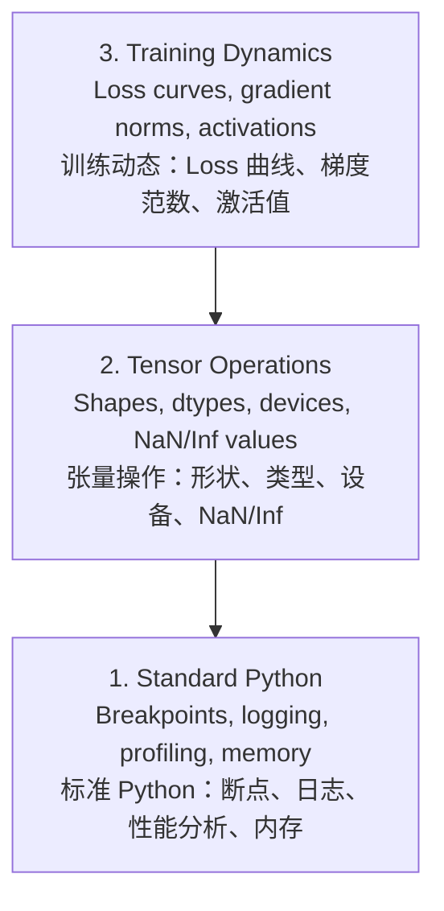

# Debugging and Profiling
> 调试与性能分析

> The worst AI bugs don't crash. They train silently on garbage and report a beautiful loss curve.
> 最坏的 AI bug 不会崩溃。它们默默用垃圾数据训练，然后给你一条漂亮的 loss 曲线。

**Type:** Build
> **类型：** 构建

**Language:** Python
> **语言：** Python

**Prerequisites:** Lesson 1 (Dev Environment), basic PyTorch familiarity
> **前置课程：** Lesson 1（开发环境），基本 PyTorch 了解

**Time:** ~60 minutes
> **时间：** ~60 分钟

## Learning Objectives
> 学习目标

- Use conditional `breakpoint()` and `debug_print` to inspect tensor shapes, dtypes, and NaN values mid-training
> 使用条件 `breakpoint()` 和 `debug_print` 在训练中检查张量形状、数据类型和 NaN 值
- Profile training loops with `cProfile`, `line_profiler`, and `tracemalloc` to find bottlenecks
> 用 `cProfile`、`line_profiler` 和 `tracemalloc` 分析训练循环，找到瓶颈
- Detect common AI bugs: shape mismatches, NaN loss, data leakage, and wrong-device tensors
> 检测常见 AI bug：形状不匹配、NaN loss、数据泄漏、张量放错设备
- Set up TensorBoard to visualize loss curves, weight histograms, and gradient distributions
> 配置 TensorBoard 可视化 loss 曲线、权重直方图和梯度分布

## The Problem
> 问题

AI code fails differently than regular code. A web app crashes with a stack trace. A misconfigured training loop runs for 8 hours, burns $200 in GPU time, and produces a model that predicts the mean of every input. The code never errored. The bug was a tensor on the wrong device, a forgotten `.detach()`, or labels leaking into features.
> AI 代码失败的方式和普通代码不同。Web 应用崩溃有堆栈跟踪。一个配置错的训练循环跑 8 小时、烧 $200 GPU 费用，产出一个对所有输入都预测均值的模型。代码从未报错。bug 是张量放在了错误的设备上、忘了 `.detach()`、或者标签泄漏进了特征。

You need debugging tools that catch these silent failures before they waste your time and compute.
> 你需要能在浪费时间和算力之前抓住这些静默失败的调试工具。

## The Concept
> 概念

AI debugging operates at three levels:
> AI 调试分三个层次：



Most people jump straight to level 3 (staring at TensorBoard). But 80% of AI bugs live at levels 1 and 2.
> 大多数人直奔第三层（盯着 TensorBoard）。但 80% 的 AI bug 在第一和第二层。

## Build It
> 从零构建

### Part 1: Print Debugging (Yes, It Works)
> 第 1 部分：Print 调试（没错，它管用）

Print debugging gets dismissed. It shouldn't. For tensor code, a targeted print statement beats stepping through a debugger because you need to see shapes, dtypes, and value ranges all at once.
> Print 调试常被轻视，但不该。对张量代码，针对性的 print 比单步调试器好用，因为你需要同时看到形状、数据类型和数值范围。

```python
def debug_print(name, tensor):
    print(f"{name}: shape={tensor.shape}, dtype={tensor.dtype}, "
          f"device={tensor.device}, "
          f"min={tensor.min().item():.4f}, max={tensor.max().item():.4f}, "
          f"mean={tensor.mean().item():.4f}, "
          f"has_nan={tensor.isnan().any().item()}")
```

Call this after every suspicious operation. When the bug is found, remove the prints. Simple.
> 在每个可疑操作后调用它。找到 bug 后删掉 print。简单。

### Part 2: Python Debugger (pdb and breakpoint)
> 第 2 部分：Python 调试器（pdb 和 breakpoint）

The built-in debugger is underrated for AI work. Drop `breakpoint()` into your training loop and inspect tensors interactively.
> 内置调试器在 AI 工作中被低估了。在训练循环里放 `breakpoint()`，交互式检查张量。

```python
def training_step(model, batch, criterion, optimizer):
    inputs, labels = batch
    outputs = model(inputs)
    loss = criterion(outputs, labels)

    if loss.item() > 100 or torch.isnan(loss):
        breakpoint()  # 条件断点：只在出问题时停下

    loss.backward()
    optimizer.step()
```

When the debugger drops you in, useful commands:
> 进入调试器后，有用命令：

- `p outputs.shape` to check shapes / 查形状
- `p loss.item()` to see the loss value / 看 loss 值
- `p torch.isnan(outputs).sum()` to count NaNs / 数 NaN 个数
- `p model.fc1.weight.grad` to check gradients / 查梯度
- `c` to continue, `q` to quit / `c` 继续，`q` 退出

This is conditional debugging. You only stop when something looks wrong. For a 10,000-step training run, that matters.
> 这是条件调试。只在出问题时停。10,000 步的训练来说，这很关键。

### Part 3: Python Logging
> 第 3 部分：Python 日志

Replace print statements with logging when your debugging goes beyond a quick check.
> 当调试不止是快速检查时，用 logging 替代 print。

```python
import logging

logging.basicConfig(
    level=logging.INFO,
    format="%(asctime)s [%(levelname)s] %(message)s",
    handlers=[
        logging.FileHandler("training.log"),   # 同时写文件
        logging.StreamHandler()                # 和终端
    ]
)
logger = logging.getLogger(__name__)

logger.info("Starting training: lr=%.4f, batch_size=%d", lr, batch_size)
logger.warning("Loss spike detected: %.4f at step %d", loss.item(), step)
logger.error("NaN loss at step %d, stopping", step)
```

Logging gives you timestamps, severity levels, and file output. When a training run fails at 3 AM, you want a log file, not terminal output that scrolled off screen.
> 日志给你时间戳、严重级别和文件输出。训练在凌晨 3 点挂掉时，你要的是日志文件，不是已经滚出屏幕的终端输出。

### Part 4: Timing Code Sections
> 第 4 部分：代码计时

Knowing where time goes is the first step to optimization.
> 知道时间花在哪是优化的第一步。

```python
import time

class Timer:
    def __init__(self, name=""):
        self.name = name

    def __enter__(self):
        self.start = time.perf_counter()
        return self

    def __exit__(self, *args):
        elapsed = time.perf_counter() - self.start
        print(f"[{self.name}] {elapsed:.4f}s")

with Timer("data loading"):
    batch = next(dataloader_iter)

with Timer("forward pass"):
    outputs = model(batch)

with Timer("backward pass"):
    loss.backward()
```

Common finding: data loading takes 60% of training time. The fix is `num_workers > 0` in your DataLoader, not a faster GPU.
> 常见发现：数据加载占训练 60% 的时间。解决方法是 DataLoader 设 `num_workers > 0`，而不是更快的 GPU。

### Part 5: cProfile and line_profiler
> 第 5 部分：cProfile 和 line_profiler

When you need more than manual timers:
> 手动计时不够时：

```bash
python -m cProfile -s cumtime train.py
```

This shows every function call sorted by cumulative time. For line-by-line profiling:
> 这按累计时间排序显示每个函数调用。逐行分析：

```bash
pip install line_profiler
```

```python
@profile
def train_step(model, data, target):
    output = model(data)
    loss = F.cross_entropy(output, target)
    loss.backward()
    return loss

# Run with: kernprof -l -v train.py / 运行方式
```

### Part 6: Memory Profiling
> 第 6 部分：内存分析

#### CPU Memory with tracemalloc
> CPU 内存：tracemalloc

```python
import tracemalloc

tracemalloc.start()

# your code here / 你的代码
model = build_model()
data = load_dataset()

snapshot = tracemalloc.take_snapshot()
top_stats = snapshot.statistics("lineno")
for stat in top_stats[:10]:
    print(stat)
```

#### CPU Memory with memory_profiler
> CPU 内存：memory_profiler

```bash
pip install memory_profiler
```

```python
from memory_profiler import profile

@profile
def load_data():
    raw = read_csv("data.csv")       # watch memory jump here / 看内存跳涨
    processed = preprocess(raw)       # and here / 这里也是
    return processed
```

Run with `python -m memory_profiler your_script.py` to see line-by-line memory usage.
> 用 `python -m memory_profiler your_script.py` 运行查看逐行内存占用。

#### GPU Memory with PyTorch
> GPU 内存：PyTorch

```python
import torch

if torch.cuda.is_available():
    print(torch.cuda.memory_summary())

    print(f"Allocated: {torch.cuda.memory_allocated() / 1e9:.2f} GB")
    print(f"Cached: {torch.cuda.memory_reserved() / 1e9:.2f} GB")
```

When you hit OOM (Out of Memory):
> 遇到 OOM（显存不足）时：

1. Reduce batch size (first thing to try, always)
> 减小 batch size（第一招，永远先试这个）
2. Use `torch.cuda.empty_cache()` to free cached memory
> 用 `torch.cuda.empty_cache()` 释放缓存
3. Use `del tensor` followed by `torch.cuda.empty_cache()` for large intermediates
> `del tensor` 然后 `torch.cuda.empty_cache()` 清理大中间量
4. Use mixed precision (`torch.cuda.amp`) to halve memory usage
> 用混合精度（`torch.cuda.amp`）减半内存
5. Use gradient checkpointing for very deep models
> 非常深的模型用梯度检查点

### Part 7: Common AI Bugs and How to Catch Them
> 第 7 部分：常见 AI Bug 及如何捕获

#### Shape Mismatch
> 形状不匹配

The most frequent bug. A tensor has shape `[batch, features]` when the model expects `[batch, channels, height, width]`.
> 最常见 bug。张量是 `[batch, features]` 但模型期望 `[batch, channels, height, width]`。

```python
def check_shapes(model, sample_input):
    print(f"Input: {sample_input.shape}")
    hooks = []

    def make_hook(name):
        def hook(module, inp, out):
            in_shape = inp[0].shape if isinstance(inp, tuple) else inp.shape
            out_shape = out.shape if hasattr(out, "shape") else type(out)
            print(f"  {name}: {in_shape} -> {out_shape}")
        return hook

    for name, module in model.named_modules():
        hooks.append(module.register_forward_hook(make_hook(name)))

    with torch.no_grad():
        model(sample_input)

    for h in hooks:
        h.remove()
```

Run this once with a sample batch. It maps every shape transformation in your model.
> 用一个样本 batch 跑一次。它会打印模型中每一层的形状变化。

#### NaN Loss
> NaN Loss

NaN loss means something exploded. Common causes:
> NaN loss 意味着炸了。常见原因：

- Learning rate too high / 学习率太高
- Division by zero in custom loss / 自定义 loss 中除以零
- Log of zero or negative number / 对 0 或负数取 log
- Exploding gradients in RNNs / RNN 梯度爆炸

```python
def detect_nan(model, loss, step):
    if torch.isnan(loss):
        print(f"NaN loss at step {step}")
        for name, param in model.named_parameters():
            if param.grad is not None:
                if torch.isnan(param.grad).any():
                    print(f"  NaN gradient in {name}")
                if torch.isinf(param.grad).any():
                    print(f"  Inf gradient in {name}")
        return True
    return False
```

#### Data Leakage
> 数据泄漏

Your model gets 99% accuracy on the test set. Sounds great. It's a bug.
> 模型测试集 99% 准确率。听起来很棒。这是 bug。

```python
def check_data_leakage(train_set, test_set, id_column="id"):
    train_ids = set(train_set[id_column].tolist())
    test_ids = set(test_set[id_column].tolist())
    overlap = train_ids & test_ids
    if overlap:
        print(f"DATA LEAKAGE: {len(overlap)} samples in both train and test")
        return True
    return False
```

Also check for temporal leakage: using future data to predict the past. Sort by timestamp before splitting.
> 还要检查时间泄漏：用未来数据预测过去。划分前按时间戳排序。

#### Wrong Device
> 设备错误

Tensors on different devices (CPU vs GPU) cause runtime errors. But sometimes a tensor silently stays on CPU while everything else is on GPU, and training just runs slowly.
> 张量在不同设备上（CPU vs GPU）会报运行时错误。但有时张量静默留在 CPU 上而其他都在 GPU 上，训练只是变慢，不报错。

```python
def check_devices(model, *tensors):
    model_device = next(model.parameters()).device
    print(f"Model device: {model_device}")
    for i, t in enumerate(tensors):
        if t.device != model_device:
            print(f"  WARNING: tensor {i} on {t.device}, model on {model_device}")
```

### Part 8: TensorBoard Basics
> 第 8 部分：TensorBoard 基础

TensorBoard shows you what's happening inside training over time.
> TensorBoard 让你看到训练过程中内部发生的变化。

```bash
pip install tensorboard
```

```python
from torch.utils.tensorboard import SummaryWriter

writer = SummaryWriter("runs/experiment_1")

for step in range(num_steps):
    loss = train_step(model, batch)

    writer.add_scalar("loss/train", loss.item(), step)
    writer.add_scalar("lr", optimizer.param_groups[0]["lr"], step)

    if step % 100 == 0:
        for name, param in model.named_parameters():
            writer.add_histogram(f"weights/{name}", param, step)
            if param.grad is not None:
                writer.add_histogram(f"grads/{name}", param.grad, step)

writer.close()
```

Launch it:
> 启动：

```bash
tensorboard --logdir=runs
```

What to look for:
> 看什么：

- **Loss not decreasing**: Learning rate too low, or model architecture issue
> **Loss 不下降**：学习率太低，或模型架构有问题
- **Loss oscillating wildly**: Learning rate too high
> **Loss 剧烈震荡**：学习率太高
- **Loss goes to NaN**: Numerical instability (see NaN section above)
> **Loss 变 NaN**：数值不稳定（见上面 NaN 部分）
- **Train loss decreasing, val loss increasing**: Overfitting
> **训练 loss 下降、验证 loss 上升**：过拟合
- **Weight histograms collapsing to zero**: Vanishing gradients
> **权重直方图坍缩到 0**：梯度消失
- **Gradient histograms exploding**: Need gradient clipping
> **梯度直方图爆炸**：需要梯度裁剪

### Part 9: VS Code Debugger
> 第 9 部分：VS Code 调试器

For interactive debugging, configure VS Code with a `launch.json`:
> 交互式调试，配置 VS Code 的 `launch.json`：

```json
{
    "version": "0.2.0",
    "configurations": [
        {
            "name": "Debug Training",
            "type": "debugpy",
            "request": "launch",
            "program": "${file}",
            "console": "integratedTerminal",
            "justMyCode": false
        }
    ]
}
```

Set breakpoints by clicking the gutter. Use the Variables pane to inspect tensor properties. The Debug Console lets you run arbitrary Python expressions mid-execution.
> 点击行号左侧设断点。用 Variables 面板查看张量属性。Debug Console 可以在执行中运行任意 Python 表达式。

Useful for stepping through data preprocessing pipelines where you want to see each transformation.
> 适合单步调试数据预处理管线，看每一步的变换。

## Use It
> 实际使用

Here's the debugging workflow that catches most AI bugs:
> 能捕获大多数 AI bug 的调试流程：

1. **Before training**: Run `check_shapes` with a sample batch. Verify input and output dimensions match expectations.
> **训练前**：用样本 batch 跑 `check_shapes`。验证输入输出维度符合预期。
2. **First 10 steps**: Use `debug_print` on loss, outputs, and gradients. Confirm nothing is NaN and values are in reasonable ranges.
> **前 10 步**：用 `debug_print` 检查 loss、输出和梯度。确认没有 NaN，值在合理范围。
3. **During training**: Log loss, learning rate, and gradient norms. Use TensorBoard for visualization.
> **训练中**：记录 loss、学习率和梯度范数。用 TensorBoard 可视化。
4. **When something breaks**: Drop `breakpoint()` at the failure point. Inspect tensors interactively.
> **出问题时**：在失败点放 `breakpoint()`。交互式检查张量。
5. **For performance**: Time your data loading vs forward vs backward pass. Profile memory if you're near OOM.
> **性能问题**：计时数据加载 vs 前向 vs 反向传播。快 OOM 时分析内存。

## Ship It
> 交付物

Run the debugging toolkit script:
> 运行调试工具脚本：

```bash
python phases/00-setup-and-tooling/12-debugging-and-profiling/code/debug_tools.py
```

See `outputs/prompt-debug-ai-code.md` for a prompt that helps diagnose AI-specific bugs.
> 见 `outputs/prompt-debug-ai-code.md`，一个帮助诊断 AI 特有 bug 的提示词。

## Exercises
> 练习

1. Run `debug_tools.py` and read through each section's output. Modify the dummy model to introduce a NaN (hint: divide by zero in the forward pass) and watch the detector catch it.
> 运行 `debug_tools.py`，通读每部分输出。修改模型故意引入 NaN（提示：前向传播里除以 0），看检测器如何捕获。
2. Profile a training loop with `cProfile` and identify the slowest function.
> 用 `cProfile` 分析训练循环，找出最慢的函数。
3. Use `tracemalloc` to find which line in your data loading pipeline allocates the most memory.
> 用 `tracemalloc` 找数据加载管线中哪行分配内存最多。
4. Set up TensorBoard for a simple training run and identify whether the model is overfitting.
> 为简单训练配置 TensorBoard，判断模型是否过拟合。
5. Use `breakpoint()` inside a training loop. Practice inspecting tensor shapes, devices, and gradient values from the debugger prompt.
> 在训练循环里用 `breakpoint()`。练习从调试器里检查张量形状、设备和梯度值。
